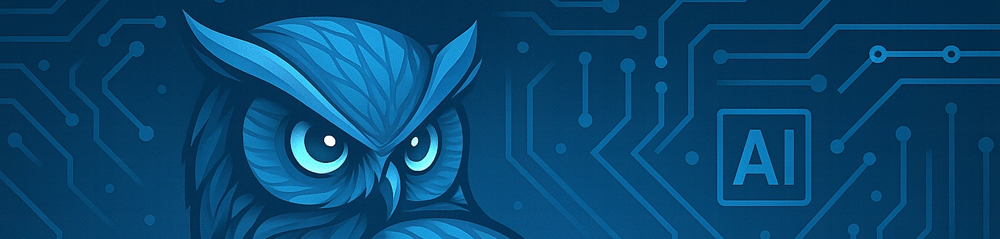
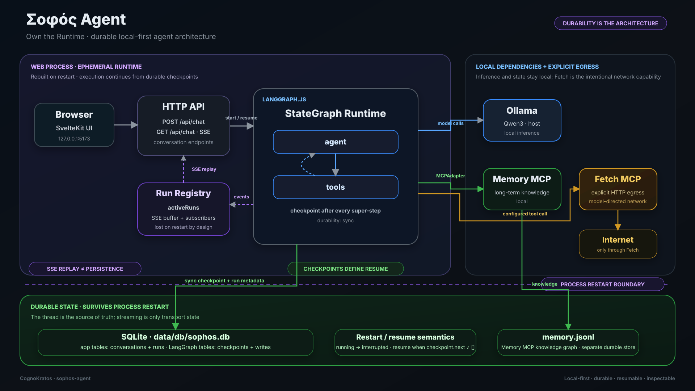

# **Σοφός Agent**: Own the Runtime

**A hands-on reference for durable agent runtime engineering, built on a small, local-first agent (Educational Project)**



---

## 📌 Overview

Sophos is a local-first agentic chat system: a SvelteKit app with an explicit single-agent LangGraph graph, a local model in Ollama, tools over MCP (Memory and Fetch), and durable state in SQLite. Inference and state stay local by default; the model reaches the network only through configured tools.

**Sophos is not the generic Agentic AI introduction.** For production agent fundamentals (agent loops, tool calling, MCP, grounding, guardrails, evaluation, observability, identity and human approval) start with [`simple-agent-template`](https://github.com/cognokratos/simple-agent-template).

Sophos is the next question: **once you have an agent, how do you make it a durable, stateful, resumable, locally owned software system?** It is a hands-on reference for durable agent runtime engineering: state, checkpoints, memory, restart/resume, streaming, process lifecycle and local-first ownership, taught against code you can run, break and inspect.

## Where Sophos fits in CognoKratos

Sophos is **Part II — Durable Agent Runtime Engineering** in the current [CognoKratos curriculum](https://github.com/cognokratos/.github/blob/main/CURRICULUM.md), an open-source, community-built curriculum for engineers learning how to build autonomous systems that can exercise real capabilities without surrendering security, verifiability or human control.

Part I asks how an agent is bounded. Sophos asks what happens when that bounded agent must live over time: who owns its process, what state is durable, what survives a crash, what replay means for side effects, and why persistence alone does not make an action safe to repeat.

> **Core lesson:** Recoverable execution is not the same thing as exactly-once execution.

The repository is a laboratory, not a claim that there is one correct runtime architecture. Read the [CognoKratos foundation](https://github.com/cognokratos/.github/blob/main/FOUNDATION.md), follow the structured synthesis in the [CognoKratos Book](https://book.cognokratos.com/part-2/introduction.html), or help [challenge and extend the curriculum](https://github.com/cognokratos/.github/blob/main/CONTRIBUTING.md).

| I want to…                                      | Go to                                                                                                                         |
| ----------------------------------------------- | ----------------------------------------------------------------------------------------------------------------------------- |
| Learn production agent engineering from scratch | [simple-agent-template — Learning path](https://github.com/cognokratos/simple-agent-template/blob/main/docs/LEARNING-PATH.md) |
| Understand durable agent runtimes and state     | [Sophos runtime learning path](docs/RUNTIME-LEARNING-PATH.md)                                                                 |
| Follow one run end to end                       | [Run lifecycle walkthrough](docs/runtime/RUN-LIFECYCLE-WALKTHROUGH.md)                                                        |
| Run the app                                     | [Getting Started](#-getting-started)                                                                                          |
| Look up how it is built                         | [Architecture reference](docs/architecture/index.md)                                                                          |

### Curriculum relationship

```text
simple-agent-template    Production Agent Engineering       how to build and bound an agent
        ↓
sophos-agent             Durable Agent Runtime Engineering  how to make that agent durable software
        ↓
etf-research-agent       Governed Decision Engineering      how to govern its decisions in a consequential domain
```

The projects do not have to be completed in order; the arrows show conceptual dependencies. [`etf-research-agent`](https://github.com/cognokratos/etf-research-agent) puts agent infrastructure into a domain where decisions have consequences.

---

## 🎯 Learning Objectives

By the end of the [runtime learning path](docs/RUNTIME-LEARNING-PATH.md), you will be able to:

- **Own the process:** say who creates, shares and closes every resource an agent uses (model client, MCP connections and child processes, database, streams, background runs), and what happens to each on failure and shutdown
- **Model execution state:** distinguish conversation, LangGraph thread, application run and checkpoint, and explain why framework state and product state differ
- **Draw durability boundaries:** decide what must survive a restart and what must not
- **Separate streaming from truth:** use SSE replay for transport recovery and checkpoints for durable state
- **Separate kinds of memory:** prompt context, conversation history, execution state, checkpoint history, application metadata and long-term knowledge
- **Design for failure:** predict run status, pending steps and resume behaviour after model, tool and process failures
- **Reason about replay:** explain why checkpointing does not make side effects exactly-once, and design idempotent tools
- **Own the data flows:** tell local-first as an enforced property from local-first as a label

This project is intended for experienced software engineers who already know what an agent loop and a tool call are, and want to understand how an agent lives over time as software.

---

## 🧠 Project Philosophy

### Local-First

Inference, conversation state and long-term memory run **on your machine** by default. The only model-directed network access is explicit: the Fetch MCP server, enabled in `mcp.json`, retrieves URLs the model asks for. Remove it and the agent has no tool-initiated network access. [Lesson 08](docs/runtime/08-local-first-and-runtime-ownership.md) examines what that does and doesn't guarantee.

### Minimalist

Every abstraction is justified. If something exists, it exists because:

- It is necessary
- It is inspectable
- It is teachable

### Durable (Not Just Chat)

This is not a stateless chatbot. The system is built around:

- An explicit, inspectable `StateGraph` (`agent` ⇄ `tools`)
- Checkpoints after every step, so completed steps survive crashes and unfinished work can be resumed
- Runs with an identity and an outcome (`running`, `interrupted`, `completed`, `failed`)
- Long-term memory kept separate from conversation history

### Security-Driven

Security is not an afterthought. The repository explicitly documents:

- Trust boundaries
- Threat models
- Risk mitigations
- Non-functional requirements

---

## 🗂 Repository Structure

See [docs/architecture/source-tree.md](docs/architecture/source-tree.md) for a detailed overview.

---

## 📚 Documentation

The documentation has two layers:

- **[Runtime learning path](docs/RUNTIME-LEARNING-PATH.md)** and **[`docs/runtime/`](docs/runtime/README.md)** — educational: why things are built this way, labs that break them, and the failure modes. Lessons, a [run lifecycle walkthrough](docs/runtime/RUN-LIFECYCLE-WALKTHROUGH.md), [case studies](docs/runtime/CASE-STUDIES.md) and [challenges](docs/runtime/CHALLENGES.md).
- **[Architecture reference](docs/architecture/index.md)** — what exists and how it is structured, kept in sync with the code. Start with [durable execution & persistence](docs/architecture/3a-durable-execution-persistence.md).

`make docs-check` verifies links, anchors, referenced files and commands across all of it.

---

## 🧩 System Architecture (Conceptual)



The key boundary is between the **ephemeral runtime** and **durable execution state**. The SvelteKit/LangGraph process, MCP connections and SSE replay buffer can disappear and be rebuilt; checkpoints and run metadata survive in SQLite. Streaming helps a browser reconnect to a live process, while checkpoints determine whether unfinished graph work can resume after that process dies.

One Node process (the `web` service) contains:

- **Chat UI and HTTP API** (SvelteKit): starts runs, streams them over SSE, serves conversations from durable state
- **Agent runtime** (LangGraph.js): an explicit single-agent graph with two nodes, `agent` and `tools`, compiled with a SQLite checkpointer
- **Run registry**: which run is active per conversation, and its in-memory SSE buffer

Outside it:

- **Model execution** (Ollama, on the host)
- **Tools** (MCP servers: Memory and Fetch; child processes under `pnpm dev`, containers under Docker Compose)
- **Durable state** (`data/db/sophos.db`: conversations, runs, checkpoints; `data/memory/memory.jsonl`: the knowledge graph)

There is no tool policy, guardrail or approval layer yet: every discovered tool is available to the model ([roadmap](docs/architecture/11-roadmap-from-prd.md)).

---

## 🔁 Run Lifecycle (Simplified)

1. **Start:** `POST /api/chat` creates the conversation (if new) and a run (`running`), then returns
2. **Execute:** LangGraph loads the thread's last checkpoint and appends the new message
3. **Reason:** the `agent` node calls the model with the system prompt and the thread's messages
4. **Act:** if the model requested tools, the `tools` node calls them over MCP
5. **Checkpoint:** after every step, before the next one starts
6. **Stream:** tokens and trace events reach the browser over SSE as they happen
7. **Finish:** the run is recorded `completed` or `failed`; the UI reloads the conversation from durable state

A crash preserves every completed checkpoint. On the next database access, a stale `running` run is marked `interrupted`; if the thread still has a pending node, it can be resumed from the last completed checkpoint. (A crash after the final checkpoint but before the run is recorded `completed` leaves an `interrupted` run with nothing to resume.) The [walkthrough](docs/runtime/RUN-LIFECYCLE-WALKTHROUGH.md) follows a real run through all of this.

---

## 🔐 Security Model

The security posture is documented in detail under `docs/architecture/9-security-posture.md`.

Key principles include:

- No implicit model-directed egress: the model reaches the network only through configured tools, and the default Fetch MCP is the intended internet capability. Other network dependencies (the Ollama host, package bootstrap by `npx`/`uvx`) are documented in [lesson 08](docs/runtime/08-local-first-and-runtime-ownership.md)
- Nothing published beyond `127.0.0.1` in the documented run modes (Docker Compose, `pnpm dev`)
- Explicit trust boundaries
- State stays on the machine (unencrypted, git-ignored under `data/`)
- No authentication: a single-user, loopback-only default, not a multi-user deployment
- Documented attack surface (Fetch egress, prompt injection, SSRF)

Generic agent security (prompt injection, guardrails, identity, approvals) is covered in depth by [`simple-agent-template`](https://github.com/cognokratos/simple-agent-template/blob/main/docs/concepts/07-security-and-trust-boundaries.md); Sophos documents the posture of this specific local system.

---

## 🧪 Suggested Experiments

Each lesson of the [runtime learning path](docs/RUNTIME-LEARNING-PATH.md) has a lab. A few to start with:

- Make an MCP server unavailable on first use, then recover without a restart ([lesson 01](docs/runtime/01-own-the-process.md))
- Kill the server after a tool result and resume without re-running the tool ([lesson 06](docs/runtime/06-failure-restart-and-resume.md))
- Disconnect a stream mid-run and reconnect with `Last-Event-ID` ([lesson 04](docs/runtime/04-streaming-is-not-persistence.md))
- Delete every conversation and see which "memory" survives ([lesson 05](docs/runtime/05-memory-is-not-one-thing.md))

Then design run cancellation, durable approvals or a replay-safe mutating tool in the [challenges](docs/runtime/CHALLENGES.md).

---

## 🤝 Contribute to the curriculum

Sophos is meant to be challenged. Useful contributions include reproducible
failure cases, better crash/replay experiments, stronger threat models,
alternative durability designs and new labs that expose where the current
architecture's assumptions stop holding.

See the CognoKratos [contribution model](https://github.com/cognokratos/.github/blob/main/CONTRIBUTING.md).

---

## 🚧 Project Status

This is an **active educational architecture**, not a finished product.

The [roadmap](docs/architecture/11-roadmap-from-prd.md) separates what is implemented today from what is planned (human-in-the-loop approval, run cancellation, observability, evals, guardrails). Sophos is a single-agent system; it does not implement multi-agent orchestration. The learning material teaches only what the code does today and labels everything else as a challenge or future design.

Students are encouraged to fork, modify, and experiment.

---

## 🧠 Who This Project Is _Not_ For

This project is **not** ideal if you want:

- A plug-and-play chatbot
- Cloud-hosted convenience
- Hidden abstractions
- “Magic” agent frameworks
- A first introduction to agents (start with [`simple-agent-template`](https://github.com/cognokratos/simple-agent-template))

This project is about **learning, control, and ownership**.

---

## 📜 License & Ownership

This repository emphasizes **long-term ownership artifacts**:

- Clear documentation
- Explicit decisions
- Reproducible environments

You should be able to understand and operate this system **years from now**, without vendor lock-in.

**License.** The original code and documentation in this repository are released under the [MIT License](LICENSE) (Copyright (c) 2026 Victor Nitu). The Σοφός logo, banner and favicon images (`src/lib/assets/`, `static/favicon/`, `docs/bg.png`) are project brand assets and are not covered by the MIT grant. Dependencies, including the Memory and Fetch MCP servers, are used under their own licences. `package.json` stays `"private": true`: that controls npm publication, not the licence.

---

## 🚀 Getting Started

Prerequisites: Node 24, Docker, and [Ollama](https://ollama.com) with the default model (`ollama pull qwen3`). For `pnpm dev` you also need `npx` and [`uv`](https://docs.astral.sh/uv/) (the MCP servers run as local stdio processes).

```sh
corepack enable                  # pnpm version comes from package.json#packageManager
pnpm install --frozen-lockfile

# Option A: local development
cp .env.example .env
pnpm dev

# Option B: Docker Compose (http://127.0.0.1:5173)
cp infra/.env.example infra/.env
make start                       # make inspector: also starts the MCP Inspector on 127.0.0.1:6274
make stop
```

The SQLite database (`data/db/sophos.db`) is created automatically on first use; `make clean-db` deletes it.

Then:

1. Read the [runtime learning path](docs/RUNTIME-LEARNING-PATH.md) and set up its [lab environment](docs/RUNTIME-LEARNING-PATH.md#lab-environment)
2. Work through the lessons, predicting before you inspect
3. Break things on disposable state
4. Use the [architecture reference](docs/architecture/index.md) for exact details

---

## ✨ Final Note

This repository is not just code.
It is a **mental model for running an agent as durable, local software**.

If you understand this project, you understand far more than how to “use” AI —
you understand how to **own its runtime**.

Happy building.
