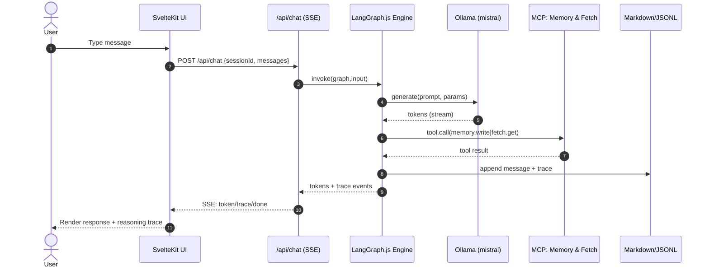

# Софос Agent — Full-Stack Architecture Document

> Single source of truth for the **local-first educational agent stack**. This unifies backend and frontend concerns to guide development and labs.

## Change Log

| Date       | Version | Description                            | Author              |
| ---------- | ------: | -------------------------------------- | ------------------- |
| 2025-10-25 |     1.0 | Initial complete architecture document | Architect (Winston) |

---

## 1) Introduction

This document defines the full-stack architecture for **Софос Agent**, an open-source, **local-first “AI Systems Classroom in a Box.”** Learners explore agent orchestration (**LangGraph.js**), on-device inference (**Ollama / Mistral**), transparent tool use (**MCP**), and inspectable persistence (**Markdown + JSONL**) — all reproducible via **Docker Compose**.

### Starter Template or Existing Project

**Decision:** N/A — **Greenfield project.** We follow BMAD Team Fullstack’s `fullstack-architecture` workflow to generate this doc as the canonical reference.

---

## 2) High-Level Architecture

### 2.1 System Context & Goals

* Deliver a **teachable** agent system with **one-command setup**, **transparent reasoning**, and **local-only** defaults.
* Stack layers per PRD: **SvelteKit UI**, **LangGraph.js** engine, **Ollama (Mistral)** LLM, **MCP** tool servers (Memory, Fetch), **Markdown** persistence, **Docker Compose** orchestration.

### 2.2 Context Diagram

```mermaid
flowchart LR
  U[Student / Educator] --> FE[SvelteKit UI<br/>/api/chat (SSE)]
  FE --> LG[LangGraph.js Engine]
  LG --> OL[Ollama (Mistral)]
  LG --> MCP[MCP Servers: Memory, Fetch]
  LG --> LOG[Markdown + trace.jsonl]
```

Local-first, Dockerized; UI ↔ Agent via thin HTTP/SSE; Agent ↔ Ollama/MCP on internal network; logs on a bind-mounted volume for inspection.

### 2.3 Core Components

* **Frontend (SvelteKit + Tailwind):** chat UI, live trace viewer.
* **Agent Engine (LangGraph.js):** graph orchestration, tool policy, evented traces.
* **LLM Runtime (Ollama/Mistral):** local inference (model pulled on warmup).
* **MCP Tools:** Memory & Fetch via `@langchain/mcp-adapters`.
* **Persistence:** Markdown turns + `trace.jsonl`.
* **Orchestration:** Docker Compose (local-only by default).

### 2.4 Non-Functional Targets

* **Setup:** ≤ **5 min** with Docker Compose and warmup.
* **Latency:** ~**2 s** p50 for baseline prompts (hardware-dependent).
* **Reliability:** **99%** startup success with healthchecks.
* **Security:** **Local-only** by default; explicit “publish” profile to expose.
* **Transparency:** 100% visible reasoning traces; no telemetry.

---

## 3) Runtime & Integration Details

### 3.1 Processes & Boundaries

* **web (SvelteKit + Agent, v0 monolith)** — UI, `/api/*` endpoints, invokes graph.
* **ollama** — model server; default `mistral`.
* **mcp-memory / mcp-fetch** — tool servers.
* **persistence** — host-mounted `data/logs/`.
  All orchestrated via Compose profiles.

### 3.2 Public HTTP API (thin surface)

* **POST `/api/chat`** — submit a turn; **SSE** stream events: `token`, `trace`, `tool`, `done`.
* **GET `/api/models`** — list available Ollama models.
* **GET `/api/logs/:sessionId`** — fetch Markdown transcript + trace refs.
  Keep endpoints minimal; move complexity into the agent engine for teachability.

### 3.3 Message Contracts (shared types)

```ts
export type Role = 'user'|'assistant'|'system'|'tool';
export interface Message { id:string; role:Role; content:string; toolCalls?: ToolCall[]; }
export interface ToolCall { id:string; name:string; args:Record<string,unknown>; }

export interface ChatRequest {
  sessionId: string;
  messages: Message[];
  tools?: { name:string; required?:boolean; argsSchema?:Record<string,unknown>; }[];
  params?: { temperature?: number; maxTokens?: number; };
}

export interface TraceNote { node:string; event:string; data?:Record<string,unknown>; }
```

Shared in `packages/shared/` to keep FE/BE consistent.

### 3.4 Streaming Protocol

**SSE** for simplicity; UI auto-downgrades to non-stream JSON if SSE fails (proxy/OS quirks). WebSocket is a Phase-2 option.

### 3.5 Unified Error Envelope

```ts
interface ApiError {
  error: { code:string; message:string; details?:Record<string,any>; timestamp:string; requestId:string; }
}
```

Standard handler on both sides; codes include `BAD_REQUEST`, `MODEL_UNAVAILABLE`, `TOOL_FAILURE`, `ENGINE_FAILURE`, `INTERNAL_ERROR`.

### 3.6 Markdown Persistence Layout

```
/data/logs/{sessionId}/
  0001.user.md
  0002.assistant.md
  trace.jsonl     # stream of TraceNote events
```

Inspectable artifacts preferred for labs; DB remains optional (Phase 2).

---

## 4) Deployment Topology (Docker Compose)

**Services (v0, monolith):**

* `web` (SvelteKit + Agent), `ollama`, `mcp-memory`, `mcp-fetch`.
  **Profiles:**
* `warmup` (pre-pull images + model), `publish` (bind to `0.0.0.0`), `split` (run agent separately).
  **Healthchecks:** `/healthz`, `/readyz` (validates Ollama & default model).

---

## 5) Trade-off Decisions

| Topic         | Decision                        | Rationale                                                                   |
| ------------- | ------------------------------- | --------------------------------------------------------------------------- |
| Service shape | **Monolith (web+agent)** for v0 | Simplest workshops; can flip to split via profile with no contract change.  |
| Streaming     | **SSE now**, WS later           | Minimal code & great for teaching; reliable fallback to non-stream JSON.    |
| Persistence   | **Markdown + JSONL**            | Human-readable learning artifacts; adapter seam for SQLite Phase 2.         |
| Tools         | **MCP: Memory & Fetch**         | Keep scope teachable; extensible via adapters.                              |
| Security      | **Local-only** default          | Avoid accidental exposure; “publish” profile is explicit.                   |
| Versions      | **Pinned**                      | Reduce tool drift across classrooms.                                        |

---

## 6) Core Workflows

### 6.1 Happy Path — Chat → LLM → Tools → Response



Transparent reasoning and tool use are explicit PRD goals.

### 6.2 Failure Paths (sketches)

* **Tool error (MCP):** bounded retry → degrade → `ApiError{code:"TOOL_FAILURE"}` surfaced to UI.
* **Model unavailable:** warmup suggests pulling default model; return `MODEL_UNAVAILABLE`.

---

## 7) Developer Experience (DX)

### 7.1 Monorepo Layout

```
apps/web (SvelteKit + Agent) • packages/shared (TS types)
infra/ (compose, Dockerfiles, profiles) • data/logs/ • scripts/ • docs/
```

**Why:** shared types, simple onboarding; aligns with Team Fullstack workflow & templates.

### 7.2 One-Command Setup

`make setup` → copy `.env`, pull images, **warm up** default model, start stack, open UI. **Profiles:** `warmup`, `publish`, `split`.

### 7.3 Testing & QA

* **Unit:** Vitest for graph nodes & adapters.
* **Integration:** Playwright for chat flow.
* **Compose smoke:** ping `/api/models`.
* **CI:** GitHub Actions; version pinning. (Education-grade, transparent.)

---

## 8) Monitoring & NFR Hooks (zero-SaaS)

* **Health:** `GET /healthz`, `GET /readyz` (ensures Ollama + model).
* **Metrics (local):** `GET /metrics.json` with p50/p90 latency, request & error counts by `ApiError.code`.
* **Dashboard (optional):** `/metrics` renders gauges/sparklines from JSON; no external deps.
* **Compose healthchecks:** verify services, support the **99% startup** goal.

---

## 9) Security Posture

* **Local-only** binds by default; no external ports unless `--profile publish`.
* No telemetry; all artifacts are local Markdown/JSONL.

---

## 10) Risks & Mitigations (excerpt)

* **Setup complexity:** warmup profile, pre-pull model/images.
* **Tool drift:** pinned versions + scheduled bumps.
* **Educator onboarding:** ready-to-teach runbooks, screenshots.
* **Hardware variability:** “small-model” profile & CPU-only guidance.

---

## 11) Roadmap (from PRD)

* **Phase 1 (Foundation):** Monolith, SSE, Markdown, Memory/Fetch, Dockerized local.
* **Phase 2 (Educational Release):** SQLite adapter, WS streaming, extra MCPs, dashboards.

---

## 12) Ownership & Artifacts

* **This document:** `docs/architecture.md` (update via Architect agent workflow).
* **PRD:** `docs/prd.md` remains requirements source.
* **Templates/agents:** BMAD Team Fullstack bundle governs workflow & standards.

---

### Appendix — Error Envelope (authoritative)

```ts
interface ApiError {
  error: {
    code: string;             // e.g., 'MODEL_UNAVAILABLE', 'TOOL_FAILURE'
    message: string;          // student-friendly
    details?: Record<string, any>;
    timestamp: string;
    requestId: string;
  };
}
```

Keep FE/BE handlers in sync with this contract.
