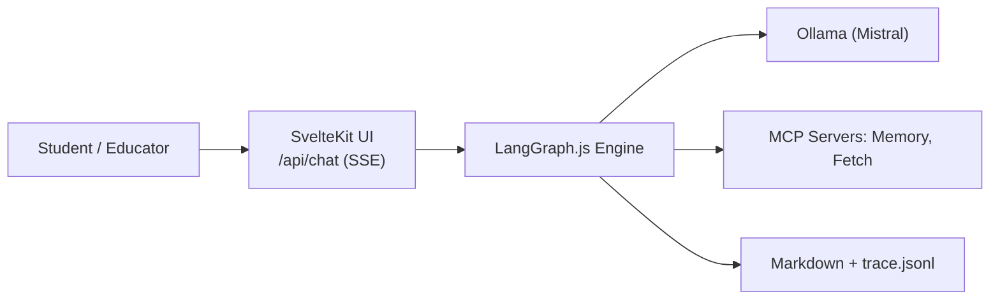

# 2) High-Level Architecture

## 2.1 System Context & Goals

- Deliver a **teachable** agent system with **one-command setup**, **transparent reasoning**, and **local-only** defaults.
- Stack layers per PRD: **SvelteKit UI**, **LangGraph.js** engine, **Ollama (Mistral)** LLM, **MCP** tool servers (Memory, Fetch), **Markdown** persistence, **Docker Compose** orchestration.

## 2.2 Context Diagram

Local-first, Dockerized; UI ↔ Agent via thin HTTP/SSE; Agent ↔ Ollama/MCP on internal network; logs on a bind-mounted volume for inspection.

## 2.3 Core Components

- **Frontend (SvelteKit + Tailwind):** chat UI, live trace viewer.
- **Agent Engine (LangGraph.js):** graph orchestration, tool policy, evented traces.
- **LLM Runtime (Ollama/Mistral):** local inference (model pulled on warmup).
- **MCP Tools:** Memory & Fetch via `@langchain/mcp-adapters`.
- **Persistence:** Markdown turns + `trace.jsonl`.
- **Orchestration:** Docker Compose (local-only by default).

## 2.4 Non-Functional Targets

- **Setup:** ≤ **5 min** with Docker Compose and warmup.
- **Latency:** ~**2 s** p50 for baseline prompts (hardware-dependent).
- **Reliability:** **99%** startup success with healthchecks.
- **Security:** **Local-only** by default; explicit “publish” profile to expose.
- **Transparency:** 100% visible reasoning traces; no telemetry.

---
