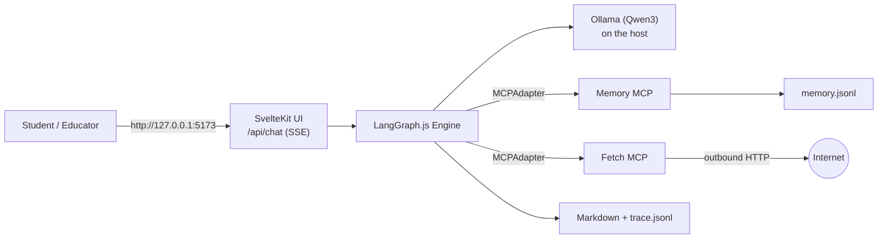

# 2) High-Level Architecture

## 2.1 System Context & Goals

- Deliver a **teachable** agent system with **one-command setup**, **transparent reasoning**, and **local inference and local state by default, with explicit network access through configured tools**.
- Stack layers: **SvelteKit UI**, **LangGraph.js** engine, **Ollama (Qwen3)** LLM, **MCP** tool servers (Memory, Fetch), **Markdown** persistence, **Docker Compose** orchestration.

## 2.2 Context Diagram

```mermaid
flowchart LR
  U[Student / Educator] -->|"http://127.0.0.1:5173"| FE["SvelteKit UI<br/>/api/chat (SSE)"]
  FE --> LG[LangGraph.js Engine]
  LG --> OL["Ollama (Qwen3)<br/>on the host"]
  LG -->|MCPAdapter| MEM[Memory MCP]
  LG -->|MCPAdapter| FET[Fetch MCP]
  FET -->|outbound HTTP| NET((Internet))
  LG --> LOG[Markdown + trace.jsonl]
  MEM --> KG[memory.jsonl]
```

The UI and the agent run in one Node process (the `web` service). The agent talks to Ollama over HTTP and to MCP servers through a single `MCPAdapter`. In Docker Compose the MCP servers are reachable only on the internal Compose network; only the web app is published, and only on `127.0.0.1`. Conversations and the knowledge graph are bind-mounted into the repository's `data/` directory.

## 2.3 Core Components

- **Frontend (SvelteKit + Tailwind):** chat UI, conversation list, reasoning trace viewer.
- **Agent Engine (LangGraph.js):** an explicit two-node `StateGraph` (`agent` ⇄ `tools`) in `src/lib/agent/index.ts`; emits `TraceNote` events. There is no tool policy layer yet: every discovered tool is bound to the model.
- **LLM Runtime (Ollama):** local inference. Ollama runs on the host; it is **not** part of the Compose stack.
- **MCP Tools:** Memory & Fetch via `@langchain/mcp-adapters` 2.x (`MCPAdapter`), configured in `mcp.json`.
- **Persistence:** Markdown turns + `trace.jsonl` per conversation; the Memory MCP keeps its own `memory.jsonl`.
- **Orchestration:** Docker Compose, loopback-only by default.

## 2.4 Non-Functional Targets

These are **targets**, not measured guarantees; there is no latency or startup-rate instrumentation yet (see [8)](./8-monitoring-nfr-hooks-zero-saas.md)).

- **Setup:** ≤ **5 min** with Docker Compose once Ollama and the model are available.
- **Latency:** ~**5 s** p50 for baseline prompts (hardware-dependent).
- **Reliability:** Compose healthchecks gate startup (`make start` waits for them).
- **Security:** nothing published beyond `127.0.0.1`; see [9) Security Posture](./9-security-posture.md).
- **Transparency:** every graph step and tool call is visible in the reasoning trace; no telemetry.

---
