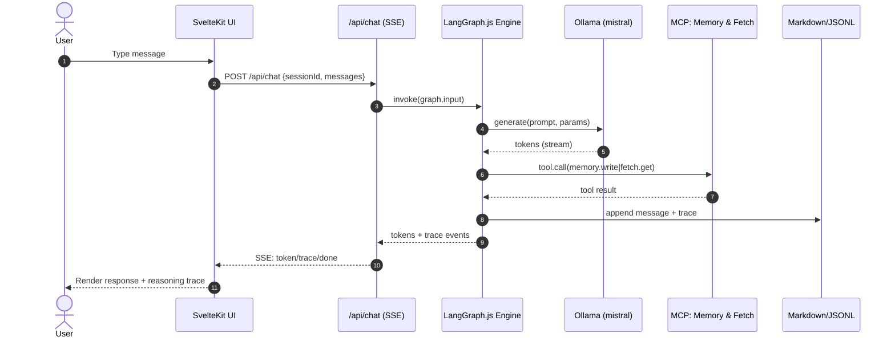

# 6) Core Workflows

## 6.1 Happy Path — Chat → LLM → Tools → Response

Transparent reasoning and tool use are explicit PRD goals.

## 6.2 Failure Paths (sketches)

* **Tool error (MCP):** bounded retry → degrade → `ApiError{code:"TOOL_FAILURE"}` surfaced to UI.
* **Model unavailable:** warmup suggests pulling default model; return `MODEL_UNAVAILABLE`.

---
