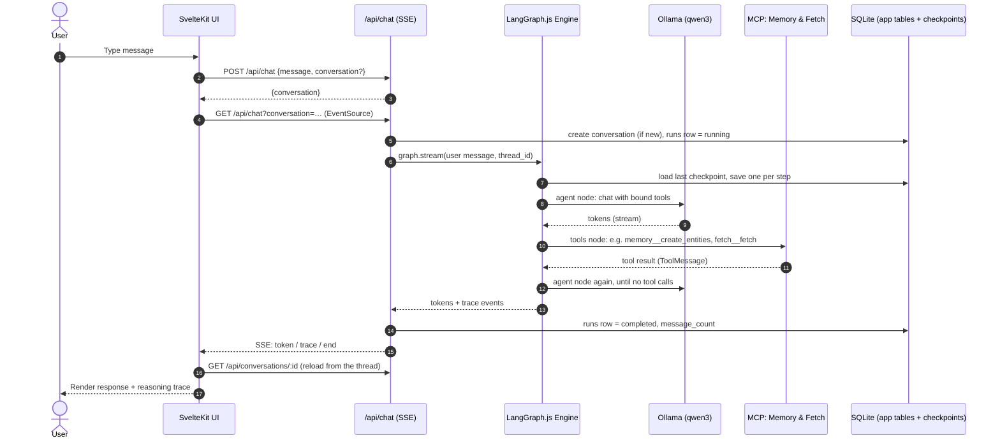

# 6) Core Workflows

## 6.1 Happy Path — Chat → LLM → Tools → Response

```mermaid
sequenceDiagram
autonumber
actor U as User
participant FE as SvelteKit UI
participant API as /api/chat (SSE)
participant LG as LangGraph.js Engine
participant LLM as Ollama (qwen3)
participant MCP as MCP: Memory & Fetch
participant DB as SQLite (app tables + checkpoints)

U->>FE: Type message
FE->>API: POST /api/chat {message, conversation?}
API-->>FE: {conversation}
FE->>API: GET /api/chat?conversation=… (EventSource)
API->>DB: create conversation (if new), runs row = running
API->>LG: graph.stream(user message, thread_id)
LG->>DB: load last checkpoint, save one per step
LG->>LLM: agent node: chat with bound tools
LLM-->>LG: tokens (stream)
LG->>MCP: tools node: e.g. memory__create_entities, fetch__fetch
MCP-->>LG: tool result (ToolMessage)
LG->>LLM: agent node again, until no tool calls
LG-->>API: tokens + trace events
API->>DB: runs row = completed, message_count
API-->>FE: SSE: token / trace / end
FE->>API: GET /api/conversations/:id (reload from the thread)
FE-->>U: Render response + reasoning trace
```

Transparent reasoning and tool use are explicit PRD goals.

## 6.2 Failure Paths (sketches)

- **Tool error reported by the server** (`isError`): the adapter returns a `ToolMessage` with `status: "error"`; the model sees it and can recover. No automatic retry.
- **MCP connection failure:** the agent node fails, the run is recorded as `failed` (`AGENT_FAILURE`), its checkpoint stays resumable, and the next run retries the connection.
- **Model unavailable:** Ollama's `model '<name>' not found` becomes `MODEL_UNAVAILABLE`. `/api/readyz` reports a missing model ahead of time.
- **Endless tool loop:** `recursionLimit` stops the run with `RECURSION_LIMIT`.
- **Crash or restart mid-run:** the run is marked `interrupted` at start-up and can be resumed from its last checkpoint (see [3a](./3a-durable-execution-persistence.md#restart-failure-and-resume)).

---
