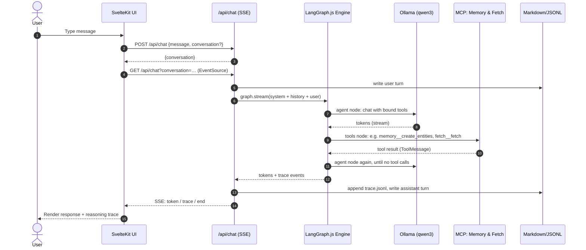

# 6) Core Workflows

## 6.1 Happy Path — Chat → LLM → Tools → Response

```mermaid
sequenceDiagram
autonumber
actor U as User
participant FE as SvelteKit UI
participant API as /api/chat (SSE)
participant LG as LangGraph.js Engine
participant LLM as Ollama (qwen3)
participant MCP as MCP: Memory & Fetch
participant LOG as Markdown/JSONL

U->>FE: Type message
FE->>API: POST /api/chat {message, conversation?}
API-->>FE: {conversation}
FE->>API: GET /api/chat?conversation=… (EventSource)
API->>LOG: write user turn
API->>LG: graph.stream(system + history + user)
LG->>LLM: agent node: chat with bound tools
LLM-->>LG: tokens (stream)
LG->>MCP: tools node: e.g. memory__create_entities, fetch__fetch
MCP-->>LG: tool result (ToolMessage)
LG->>LLM: agent node again, until no tool calls
LG-->>API: tokens + trace events
API->>LOG: append trace.jsonl, write assistant turn
API-->>FE: SSE: token / trace / end
FE-->>U: Render response + reasoning trace
```

Transparent reasoning and tool use are explicit PRD goals.

## 6.2 Failure Paths (sketches)

- **Tool error reported by the server** (`isError`): the adapter returns a `ToolMessage` with `status: "error"`; the model sees it and can recover. No automatic retry.
- **MCP connection failure at startup:** graph construction fails, the run ends with `ChatError{code:"AGENT_FAILURE"}`, and the next request retries the connection.
- **Model unavailable:** the agent node raises `MODEL_UNAVAILABLE`, which currently reaches the UI as `AGENT_FAILURE` with that message (the dedicated error code is not yet mapped). `/api/readyz` reports a missing model ahead of time.

---
