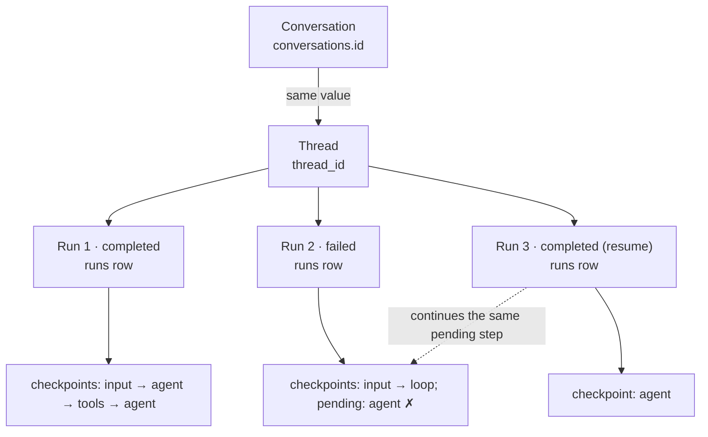

# 02 — Model execution state

> Framework state models and application state models are not necessarily the same thing.

**Stage R2 · What is an execution?** · [Learning path](../RUNTIME-LEARNING-PATH.md#stage-r2-what-is-an-execution) · Previous: [01](01-own-the-process.md) · Next: [03](03-design-durability-boundaries.md)

## Objective

Distinguish the four identities Sophos keeps for one chat (**conversation**, **thread**, **run**, **checkpoint**), say where each is stored and who writes it, and explain from observed state why a LangGraph thread id can't serve as a run id.

## Why it matters

"The agent is working on it", "the answer failed", "try again", "continue where it stopped": each of these needs an identity with a lifetime and an outcome. LangGraph gives you a persistent thread and a checkpoint after each step. It does not give you "this attempt, started at 14:02, failed with `MODEL_UNAVAILABLE`". If you need that (and every product with a status indicator does), you have to model it yourself.

## Mental model

| Identity         | What it is                                                                                      | Identity value                 | Stored in                                               | Written by                                         | Lifetime                          |
| ---------------- | ----------------------------------------------------------------------------------------------- | ------------------------------ | ------------------------------------------------------- | -------------------------------------------------- | --------------------------------- |
| **Conversation** | What the user sees in the sidebar: a title, timestamps, a message count, the latest status      | `conversations.id` (UUID)      | `conversations` table                                   | Sophos (`persistence/conversations.ts`)            | until the database is deleted     |
| **Thread**       | LangGraph's persistent workflow identity; its state is the message list                         | `thread_id` = conversation id  | `checkpoints` and `writes` tables                       | `SqliteSaver` (LangGraph)                          | same as the conversation          |
| **Run**          | One application-level execution attempt: from a new message (or a resume) until the graph stops | `runs.id` (UUID per attempt)   | `runs` table                                            | Sophos (`runs.ts`, `persistence/conversations.ts`) | one row per attempt, kept forever |
| **Checkpoint**   | The thread's persisted state after one super-step                                               | `checkpoint_id` (time-ordered) | `checkpoints` (state) + `writes` (pending task outputs) | `SqliteSaver`, after every step                    | kept forever (no pruning)         |



Two facts the diagram encodes:

- The arrows from runs to checkpoints exist **only in your head**. Checkpoint metadata is `{"source", "step", "parents"}`. Nothing in the `checkpoints` table points at a `runs` row.
- A failed run and the resume that completes it are **two runs** working on **one** LangGraph execution (one pending step).

## Where it lives in Sophos

- `src/lib/agent/graph.ts` — `threadConfig(conversationId)` returns `{ configurable: { thread_id: conversationId } }`. That one line is the whole mapping between product and framework.
- `src/lib/agent/persistence/database.ts` — the `conversations` and `runs` schema. `runs.status` is constrained to `running`, `interrupted`, `completed`, `failed`.
- `src/lib/agent/persistence/conversations.ts` — `startRun()` inserts `running` and bumps `updated_at` in one transaction; `finishRun()` records the outcome and the thread's message count in one transaction; `recoverInterruptedRuns()` turns leftover `running` rows into `interrupted`.
- `src/lib/agent/runs.ts` — generates the run id (`randomUUID()`), keeps one active run per conversation, maps exceptions to error codes.
- `src/lib/agent/index.ts` — `getThreadState()` reads the latest checkpoint; `next` is non-empty when the thread has a step still to run.

## Experiment

Use the [lab environment](../RUNTIME-LEARNING-PATH.md#lab-environment).

### Build the history

**Run 1 and run 2: two completed turns.**

```sh
C=$(curl -s -X POST $B/api/chat -H 'content-type: application/json' \
  -d '{"message":"Name one prime number. Answer in one word."}' | jq -r .conversation)
curl -sN "$B/api/chat?conversation=$C" | tail -2
curl -s -X POST $B/api/chat -H 'content-type: application/json' \
  -d "{\"message\": \"Name another one.\", \"conversation\": \"$C\"}"
curl -sN "$B/api/chat?conversation=$C" | tail -2
echo $C
```

**Run 3: a failing run.** Stop the lab server (Ctrl+C) and start it again with an unreachable model server: put `OLLAMA_HOST=http://127.0.0.1:59999` in front of the usual command. In terminal 2 (same shell, so `C` is still set):

```sh
curl -s -X POST $B/api/chat -H 'content-type: application/json' \
  -d "{\"message\": \"And a third one.\", \"conversation\": \"$C\"}"
curl -sN "$B/api/chat?conversation=$C"
```

**Run 4: the resume.** Stop the lab server and start it normally. Then:

```sh
curl -s -X POST $B/api/chat -H 'content-type: application/json' \
  -d "{\"resume\": true, \"conversation\": \"$C\"}"
curl -sN "$B/api/chat?conversation=$C" | tail -2
```

### Predict

Before you look: how many rows are in `conversations`? In `runs`? How many checkpoints does the thread have, and which step numbers? Which run "owns" the user message `And a third one.`?

### Inspect

```sh
sqlite3 -header -column $DB "SELECT id, title, message_count FROM conversations"
sqlite3 -header -column $DB \
  "SELECT id, status, error_code, started_at, finished_at FROM runs WHERE conversation_id = '$C' ORDER BY started_at"
curl -s "$B/api/conversations/$C/export?format=jsonl" | jq -c '{step, source, next, message_count, role: .last_message.role}'
sqlite3 $DB "SELECT DISTINCT CAST(metadata AS TEXT) FROM checkpoints WHERE thread_id = '$C' LIMIT 3"
sqlite3 -header -column $DB "SELECT checkpoint_id, idx, channel FROM writes WHERE thread_id = '$C' AND channel = '__error__'"
curl -s $B/api/conversations/$C | jq -c '.messages[] | {id, role}'
```

Open <http://127.0.0.1:5174> as well and select the conversation.

**Observed** (with this exact sequence):

- `conversations`: **one** row.
- `runs`: **four** rows: `completed`, `completed`, `failed` (`AGENT_FAILURE`, `fetch failed`), `completed`.
- Checkpoints: one `input` checkpoint per user message (at steps −1, 2 and 5 here: step numbers continue across runs on the same thread), a `loop` checkpoint after each step, and **no checkpoint for the failed agent step**. The failed run left the thread at `next: ["agent"]`; the resume added exactly one checkpoint, the agent step it had been unable to finish.
- Metadata is `{"source":"…","step":…,"parents":{}}`. No run id.
- `writes` holds an `__error__` row for the failed task: LangGraph records that the task failed, not which application attempt it belonged to.
- Message ids of assistant messages start with `run-`. That prefix is LangChain's callback run id. Compare it with `runs.id`: unrelated. The word "run" is overloaded three times in this stack (LangChain callback runs, LangGraph Platform runs, Sophos `runs`); only the last one is in your database.
- The UI shows one conversation with three answers and status `completed`. The failure is visible only in the `runs` table.

### Answer from the observed state

> Why can't a LangGraph thread id be treated as a run id?

Write your answer before reading on. Use the rows above as evidence.

<details>
<summary>One answer</summary>

The thread id was the same for all four runs, so it can't distinguish them. Nothing in the checkpoint data can recover the runs either: checkpoints carry no run id, one run produced several checkpoints, the failed run produced **zero** new loop checkpoints (its failure exists only as an `__error__` pending write), and the resume continued a step that "belongs" to the failed run. The outcome `failed` with `fetch failed` and its timestamps exist only because Sophos wrote a `runs` row. Without it, "did the third message fail, and when?" has no answer.

</details>

## Why the system behaves this way

- **Conversation id = thread id** is a deliberate one-to-one mapping: one chat is one workflow history, so the UI's identity and LangGraph's identity can share a value without a lookup table. (A product with branching or forked conversations could not do this.)
- **Runs are an application concept.** LangGraph's job is to execute and checkpoint steps; deciding that a group of steps was _one attempt by the user_, and that it _failed with a code the UI can show_, is product semantics.
- **The run row is written before the graph runs** (`startRun()` before `execute()`), so even a crash in the first millisecond leaves a `running` row to be recovered as `interrupted`.
- **Outcome and message count are written together** in `finishRun()`, so the sidebar never shows a status from one moment and a count from another.

## What this does NOT guarantee

- **No link from checkpoints to runs.** You can correlate by timestamp, not by key. (Storing the run id in checkpoint metadata, via LangGraph's run config, would be one way to add it. Sophos doesn't.)
- **One active run per conversation is enforced in memory** (`getActiveRun()` in `src/routes/api/chat/+server.ts`), not by the database. It holds for one process. See [challenge 5](CHALLENGES.md#challenge-5--postgresql-migration).
- **`runs.status` and the thread can disagree.** [Lesson 01, part 4](01-own-the-process.md#part-4-shut-down-while-a-run-is-in-flight) produced a `failed` run whose cause was the shutdown, not the agent. `next` is the authority on whether there is work left; `runs.status` is the authority on what Sophos told the user.

## Takeaway

> Framework state models and product state models are not necessarily the same thing.

LangGraph answers "what is the state of this workflow, and what runs next?". Sophos needed "what did the user ask for, did it work, and when?", so it added a table.

## Go deeper

- Reference: [3a Terminology](../architecture/3a-durable-execution-persistence.md#terminology), [3a Storage layout](../architecture/3a-durable-execution-persistence.md#storage-layout).
- Case study: [Why Sophos added a `runs` table](CASE-STUDIES.md#why-sophos-added-a-runs-table).
- Tests: `src/lib/agent/persistence/conversations.spec.ts` (status tracking, recovery), `src/lib/agent/runs.spec.ts`.
