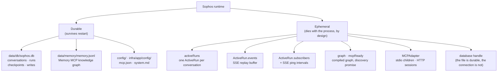

# 03 — Design durability boundaries

> Persist semantics, not everything.

**Stage R3 · What must survive?** · [Learning path](../RUNTIME-LEARNING-PATH.md#stage-r3-what-must-survive) · Previous: [02](02-model-execution-state.md) · Next: [04](04-streaming-is-not-persistence.md)

## Objective

Name every piece of state in the Sophos runtime, say whether it is durable or ephemeral and why, and predict what a graceful stop and a hard kill each leave behind.

## Why it matters

Every durable byte is a commitment: it must be migrated, backed up, secured, deleted on request and kept consistent with everything else. Every ephemeral byte is a bet that losing it is acceptable. The boundary between the two is an architectural decision, and in agent systems it is often made by default: by whatever the framework happens to persist.

## Mental model



The rule Sophos applies:

| Durable                                                                                                                                    | Ephemeral                                                                                               |
| ------------------------------------------------------------------------------------------------------------------------------------------ | ------------------------------------------------------------------------------------------------------- |
| Facts about **what happened** and **what is left to do**: messages, tool calls and results, run outcomes, pending steps, learned knowledge | Machinery for **doing it right now**: connections, child processes, subscribers, buffers, compiled code |
| Rebuilding it is impossible or would change the meaning                                                                                    | Rebuilding it is cheap and deterministic, or losing it is harmless                                      |

## Where it lives in Sophos

| State                                | Name in code                                   | Stored in                                                      | Owner                     |
| ------------------------------------ | ---------------------------------------------- | -------------------------------------------------------------- | ------------------------- |
| Conversation metadata                | `conversations` table                          | SQLite                                                         | Sophos                    |
| Run outcomes                         | `runs` table                                   | SQLite                                                         | Sophos                    |
| Messages, tool calls, tool results   | `messages` channel of the thread state         | `checkpoints` (SQLite)                                         | LangGraph (`SqliteSaver`) |
| Pending task outputs and task errors | pending writes                                 | `writes` (SQLite)                                              | LangGraph                 |
| Long-term knowledge                  | entities, relations, observations              | `memory.jsonl`                                                 | Memory MCP server         |
| Active run per conversation          | `activeRuns` (`src/lib/agent/runs.ts`)         | RAM                                                            | Sophos                    |
| SSE replay buffer                    | `ActiveRun.events`                             | RAM                                                            | Sophos                    |
| Connected browsers                   | `ActiveRun.subscribers`                        | RAM                                                            | Sophos (route handler)    |
| Compiled graph, discovery state      | `graph`, `mcpReady` (`src/lib/agent/index.ts`) | RAM                                                            | Sophos                    |
| MCP connections and child processes  | `MCPAdapter` in `MCPClientService`             | RAM / OS processes                                             | the adapter               |
| System prompt                        | `config/system.md`                             | file, read on every model call, **never** stored in the thread | you                       |

The comment at the top of `src/lib/agent/runs.ts` states the split; [3a](../architecture/3a-durable-execution-persistence.md#what-is-durable-what-is-in-memory) has the reference table.

## Experiment

### Classify first

Fill in the table before you run anything. For each item, decide whether it **should** survive a restart and write down **why** in one line.

| Item                                       | Should survive restart? | Why? |
| ------------------------------------------ | :---------------------: | ---- |
| assistant message                          |                         |      |
| tool result (e.g. a fetched page)          |                         |      |
| active HTTP connection (SSE stream)        |                         |      |
| checkpoint                                 |                         |      |
| pending write of a failed task             |                         |      |
| stdio pipe to the Memory server            |                         |      |
| run status                                 |                         |      |
| SSE replay buffer                          |                         |      |
| the "one active run per conversation" flag |                         |      |
| compiled graph                             |                         |      |
| long-term memory entity                    |                         |      |
| the system prompt as sent to the model     |                         |      |

### Graceful stop

Use the [lab environment](../RUNTIME-LEARNING-PATH.md#lab-environment). Create a conversation with a completed tool call:

```sh
C=$(curl -s -X POST $B/api/chat -H 'content-type: application/json' \
  -d '{"message":"Fetch https://example.com and tell me in one sentence what it says."}' | jq -r .conversation)
curl -sN "$B/api/chat?conversation=$C" | tail -2
ls data/lab/db
```

**Predict:** after Ctrl+C, which files remain in `data/lab/db`? Is the fetched page still somewhere on disk?

Stop the lab server with Ctrl+C, then:

```sh
ls data/lab/db
sqlite3 $DB "SELECT count(*) FROM checkpoints WHERE thread_id = '$C'"
```

Start it again and reload the conversation (`curl -s $B/api/conversations/$C | jq '.messages[] | {role, name}'`, or the UI).

**Observed:** while the server ran, `data/lab/db` held `sophos.db`, `sophos.db-wal` and `sophos.db-shm`; after the graceful stop, only `sophos.db` (closing the connection checkpointed the WAL). After restart, every message reloaded, **including the tool result**: the fetched page content is now part of your durable state.

### Hard kill

Start a long run and kill the process (not Ctrl+C) while it streams:

```sh
C=$(curl -s -X POST $B/api/chat -H 'content-type: application/json' \
  -d '{"message":"Write a detailed 500-word essay about SQLite WAL mode."}' | jq -r .conversation)
sleep 3
kill -9 $(lsof -nP -tiTCP:5174 -sTCP:LISTEN)
ls data/lab/db
sqlite3 $DB "SELECT status FROM runs WHERE conversation_id = '$C'"
```

**Predict:** is the run `running`, `interrupted` or `failed` right now? What happens to it when the server starts?

**Observed:** `running`, with the `-wal` file still on disk. Start the lab server, call `curl -s $B/api/conversations > /dev/null`, and query again: `interrupted`. SQLite replays its WAL on open; Sophos replays nothing: `recoverInterruptedRuns()` simply relabels runs that can no longer be running. The essay tokens the stream had shown are gone, and the thread is resumable from its last checkpoint ([lesson 06](06-failure-restart-and-resume.md)).

## Why the system behaves this way

- **One file for everything durable that Sophos owns.** App tables reuse the checkpointer's `better-sqlite3` connection: one thing to back up, inspect or delete ([5) Trade-off Decisions](../architecture/5-trade-off-decisions.md)).
- **Messages are stored once**, in the thread. The `conversations` table holds only metadata and a denormalized `message_count`, so the sidebar never deserializes a checkpoint.
- **`durability: 'sync'`** (`src/lib/agent/index.ts`) makes each checkpoint durable before the next step starts. SQLite's WAL makes each write atomic.
- **Nothing ephemeral is worth restoring.** A connection to a process that no longer exists, a subscriber whose socket is closed, a buffer of tokens whose meaning is already in the checkpoint: restoring them would be wrong, not just wasteful.

## What this does NOT guarantee

- **Durable is not safe.** The SQLite file and `memory.jsonl` are unencrypted, and tool results (whole fetched pages) are stored in the checkpoints ([9) Security Posture](../architecture/9-security-posture.md#data)).
- **Nothing is pruned.** Every checkpoint of every run is kept; the database only grows.
- **Two durable stores, no transaction across them.** A run can write to `memory.jsonl` and then fail before its checkpoint lands. See [lesson 07](07-side-effects-and-idempotency.md).
- **Configuration is durable but not versioned with the state.** Editing `config/system.md` changes how every existing conversation continues.

## Questions

Answer both with examples from Sophos:

1. **What would go wrong if we persisted every transient transport detail?** Think about restoring an `ActiveRun` with subscribers that no longer exist, an SSE buffer of tokens next to the checkpointed message they spell out, or an MCP session id for a server process that died.
2. **What would go wrong if we persisted too little?** Think about the [pre-SQLite design](CASE-STUDIES.md#markdown-stopped-being-the-database), which stored user and assistant text but not tool calls, tool results or run status.

## Takeaway

> Persist semantics, not everything.

Durable state in Sophos answers two questions: _what happened?_ and _what is left to do?_ Everything else is rebuilt or let go.

## Go deeper

- Reference: [3a What is durable, what is in memory](../architecture/3a-durable-execution-persistence.md#what-is-durable-what-is-in-memory).
- Tests: `src/lib/agent/graph.spec.ts` (`persists a conversation that a fresh graph instance can read back`).
