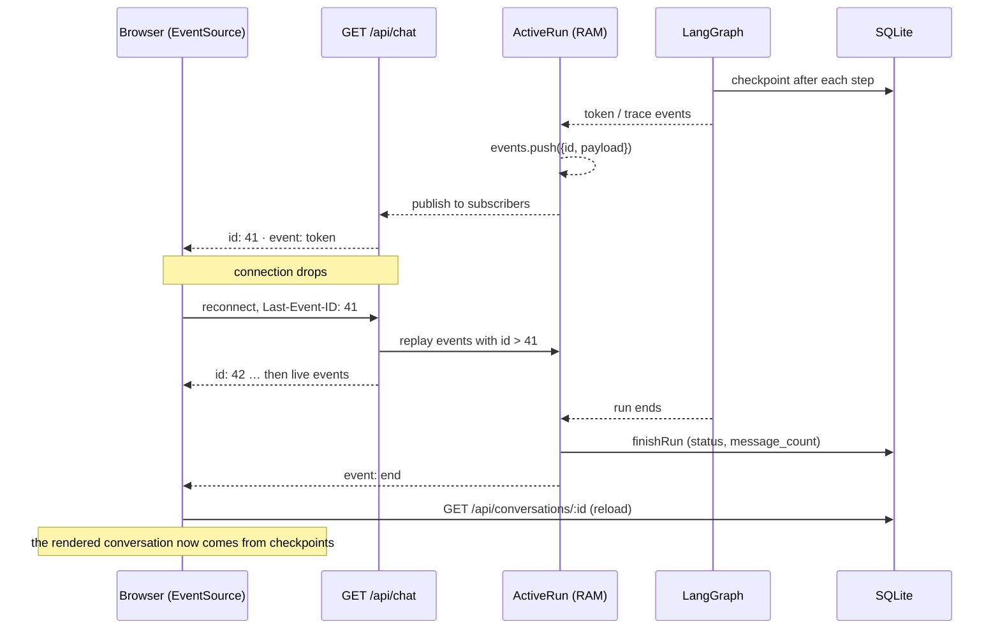

# 04 — Streaming is not persistence

> Streaming should project durable execution, not become the source of truth.

**Stage R4 · How do users see live execution?** · [Learning path](../RUNTIME-LEARNING-PATH.md#stage-r4-how-do-users-see-live-execution) · Previous: [03](03-design-durability-boundaries.md) · Next: [05](05-memory-is-not-one-thing.md)

## Objective

Explain the two paths by which a user sees a run (the live SSE stream and the durable conversation), what `Last-Event-ID` replay recovers and what it can't, and why Sophos doesn't persist streamed tokens.

## Why it matters

The stream is what the user watches, so it is tempting to treat it as what happened. It isn't. It is a lossy, process-local projection of execution. When the projection and the record disagree (after a reconnect, a crash or a partial answer), the UI must defer to the record or it will show users something that never became state.

## Mental model

```text
live stream      = transport      (per run, per process, in RAM)
checkpoint state = durable truth  (per thread, in SQLite)
```



Three properties of the stream:

1. **Event ids are per run and per process.** `publish()` numbers events 1, 2, 3… within one `ActiveRun`. They mean nothing after the run ends or the process restarts.
2. **The buffer lives exactly as long as the run.** `execute()` deletes the `ActiveRun` when the run ends. A reconnect after that gets the durable answer instead: one `end` event with the last run's status, and no id.
3. **The UI reloads on `end` and on `chat-error`.** `finishStream()` in `src/routes/+page.svelte` discards the locally appended tokens and renders `GET /api/conversations/:id`. Tokens are presentation; the thread is the conversation.

## Where it lives in Sophos

- `src/lib/agent/runs.ts` — `publish()` (assign id, buffer, fan out), `subscribe()` (replay after `lastEventId`, then add the subscriber).
- `src/routes/api/chat/+server.ts` — `GET`: reads `Last-Event-ID`; with no active run, answers from SQLite with a single `end` or `chat-error`; sends a `ping` every 15 s; closes after `end` or `chat-error`.
- `src/routes/+page.svelte` — `startSse()` (EventSource reconnects by itself and sends `Last-Event-ID`), `finishStream()` (reload from durable state).
- `src/lib/chat.ts` — `formatEvent()`: the SSE wire format.

## Experiment

Use the [lab environment](../RUNTIME-LEARNING-PATH.md#lab-environment). Use a prompt that produces a few hundred token events.

### 1–4: Disconnect, reconnect, replay

```sh
C=$(curl -s -X POST $B/api/chat -H 'content-type: application/json' \
  -d '{"message":"Write a detailed 500-word essay about SQLite WAL mode."}' | jq -r .conversation)
curl -sN -m 3 "$B/api/chat?conversation=$C" > data/lab/part1.txt   # disconnect after 3 s
LAST=$(grep '^id:' data/lab/part1.txt | tail -1 | cut -d' ' -f2); echo "last seen: $LAST"
sleep 2
curl -sN -H "Last-Event-ID: $LAST" "$B/api/chat?conversation=$C" > data/lab/part2.txt
grep '^id:' data/lab/part2.txt | head -1
tail -3 data/lab/part2.txt
```

**Predict:** what is the first id in `data/lab/part2.txt`? Are the events produced during the 2 s you were away lost?

**Observed** (one run): the first stream stopped after id 48; the reconnect started at id 49 and ran to id 528, then `end` with `status: completed`. Nothing generated while disconnected was lost, and nothing was sent twice. In the browser, the same happens automatically: `EventSource` reconnects with the last id it received.

### 5–6: Complete, then reload from durable state

```sh
curl -sN -H "Last-Event-ID: 3" "$B/api/chat?conversation=$C"
curl -s $B/api/conversations/$C | jq '{status: .conversation.status, messages: [.messages[].role]}'
```

**Observed:** after the run ended, asking for "everything after event 3" returns a single `end` event with no id: the buffer is gone, and the server answers from the `runs` table. The conversation itself comes from the latest checkpoint.

**The two projections can differ.** With `OLLAMA_THINK=true` (the default in `.env.example`), the `token` events of a step carry the model's reasoning, while the checkpointed message keeps it in `additional_kwargs.reasoning_content` and `GET /api/conversations/:id` returns only the message text. In the [walkthrough run](RUN-LIFECYCLE-WALKTHROUGH.md#7-the-agent-node-executes), the stream showed 2,682 tokens of reasoning that the reloaded conversation does not show. The record decides what the conversation is; the stream only showed it being produced.

### 7–10: Restart while streaming

Start another long run, attach a stream in a third terminal, and kill the server while tokens are flowing:

```sh
C=$(curl -s -X POST $B/api/chat -H 'content-type: application/json' \
  -d '{"message":"Write a detailed 500-word essay about B-trees."}' | jq -r .conversation)
# third terminal: curl -N "$B/api/chat?conversation=$C"
sleep 4
kill -9 $(lsof -nP -tiTCP:5174 -sTCP:LISTEN)
```

**Predict:** the stream showed part of an essay. After restart, will that partial essay be in the conversation? Can you reconnect with `Last-Event-ID` and get the rest?

Start the lab server again:

```sh
curl -sN -H "Last-Event-ID: 10" "$B/api/chat?conversation=$C"
curl -s $B/api/conversations/$C | jq '{status: .conversation.status, roles: [.messages[].role], resumable}'
```

**Observed:** the stream answers `end` with `status: interrupted`; there is nothing to replay. The conversation contains the user message only: the partial essay was never a checkpoint, because the `agent` step never finished. `resumable` is `true`. Resuming generates the essay again, from scratch, as a new model sample ([lesson 06](06-failure-restart-and-resume.md)).

### Explain

> Why doesn't Sophos persist every streamed token?

Answer it yourself, then compare:

- **Tokens are presentation transport.** The completed `AIMessage` in the checkpoint is the same text, already assembled, with its tool calls attached.
- **Duplication.** Persisted tokens would be a second copy of every message, which must then agree with the first.
- **Volume and write amplification.** One 500-word answer was ~500 events. As individual durable writes, that is hundreds of transactions per answer, on the hot path of generation.
- **Replay complexity.** Persisted tokens of an unfinished step describe output that never became state. After a resume, the regenerated answer differs; you would have to reconcile or delete the orphaned tokens.
- **Final state is reconstructable.** Everything a client needs after the fact is in `GET /api/conversations/:id`.

The trade-off: a user who reloads mid-run sees the conversation up to the last completed step, then catches up through the buffer, but only if the process that has the buffer is still alive.

## Why the system behaves this way

- **SSE fits a one-way, per-run stream** and gets reconnection with `Last-Event-ID` from the browser for free ([5) Trade-off Decisions](../architecture/5-trade-off-decisions.md)).
- **The buffer is complete for the run's lifetime**, so a late subscriber (the UI opens its `EventSource` after `POST` returns) or a reconnecting one never misses events.
- **"Persist first, then notify"** (`execute()` in `src/lib/agent/runs.ts`): `finishRun()` runs before `end` is published, so a client that reloads on `end` always sees the final state.

## What this does NOT guarantee

- SSE replay is **in-memory transport recovery within a process lifetime**. A restart loses the buffer; durable conversation state comes from checkpoints.
- The buffer is **unbounded for the run's lifetime** (every token of every step); a very long run holds all of its events in RAM.
- Replay works **only against the process that runs the run.** With two server processes behind a load balancer, a reconnect could land on the wrong one ([challenge 4](CHALLENGES.md#challenge-4--separate-worker-process)).
- `ping` events carry no id, so they never advance `Last-Event-ID`.

## Takeaway

> Streaming is transport; checkpoints are state.

Streaming should project durable execution. When the projection ends, for whatever reason, the UI goes back to the record.

## Go deeper

- Reference: [3.4 Streaming Protocol](../architecture/3-runtime-integration-details.md#34-streaming-protocol).
- Case study: [Why SSE replay isn't persistence](CASE-STUDIES.md#why-sse-replay-isnt-persistence).
- Tests: `src/lib/agent/runs.spec.ts` (`replays buffered events after Last-Event-ID to a late subscriber`).
