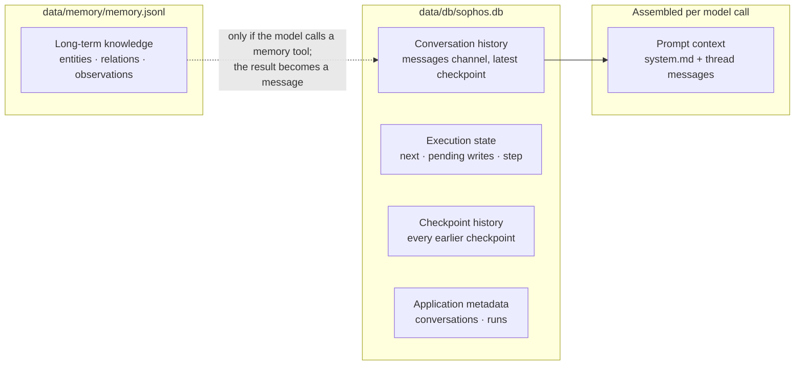

# 05 — Memory is not one thing

> "Memory" is not a storage technology. It is several different semantic responsibilities that should not be conflated.

**Stage R5 · What does "memory" mean?** · [Learning path](../RUNTIME-LEARNING-PATH.md#stage-r5-what-does-memory-mean) · Previous: [04](04-streaming-is-not-persistence.md) · Next: [06](06-failure-restart-and-resume.md)

> **Prerequisite:** you know why the model's own knowledge is not a system of record. If not: [simple-agent-template — Grounding and authoritative state](https://github.com/cognokratos/simple-agent-template/blob/main/docs/concepts/03-grounding-and-authoritative-state.md).

## Objective

Separate six things people call "agent memory", map each to its storage and owner in Sophos, and show by experiment that deleting one leaves the others behind.

## Why it matters

"Does the agent remember X?" has six different answers depending on which mechanism you mean, and each one has a different owner, lifetime, size limit and deletion path. A system that treats them as one feature can't answer "what does it know about me?" or "is it gone now?" truthfully.

## Mental model



| Responsibility           | Question it answers                              | In Sophos                                                                                            | Owner                     | Scope                 | Deleted by                                             |
| ------------------------ | ------------------------------------------------ | ---------------------------------------------------------------------------------------------------- | ------------------------- | --------------------- | ------------------------------------------------------ |
| **Prompt context**       | What does the model see right now?               | `[system, ...state.messages]`, built in `agentNode()` on every call; never stored                    | Sophos, at call time      | one model call        | nothing to delete                                      |
| **Conversation history** | What was said in this chat?                      | the `messages` channel of the thread's latest checkpoint (user, assistant, tool calls, tool results) | LangGraph (`SqliteSaver`) | one thread            | deleting the database (no per-conversation delete API) |
| **Execution state**      | What is left to do in this workflow?             | `next`, pending writes, step number                                                                  | LangGraph                 | one thread            | finishing the run, or deleting the database            |
| **Checkpoint history**   | What did the state look like after each step?    | every earlier checkpoint (`getStateHistory()`, `?format=jsonl` export)                               | LangGraph                 | one thread, all runs  | deleting the database                                  |
| **Application metadata** | Which chats exist, and how did each attempt end? | `conversations` and `runs` tables                                                                    | Sophos                    | all conversations     | deleting the database                                  |
| **Long-term knowledge**  | What has the agent learned that outlives a chat? | Memory MCP knowledge graph in `memory.jsonl`, written and read only through tool calls               | Memory MCP server         | **all** conversations | deleting `memory.jsonl` (or `memory__delete_*` tools)  |

Two things are not on the list on purpose: the model's weights (what it learned in training; not yours to edit) and the SSE buffer (transport, [lesson 04](04-streaming-is-not-persistence.md)).

## Where it lives in Sophos

- `src/lib/agent/graph.ts` — `agentNode()`: `model.invoke([system, ...state.messages])`. The **entire** thread goes to the model on every call; Sophos does no trimming or summarization. What happens when that exceeds the model's context window is decided by Ollama's settings (`num_ctx`), not by Sophos.
- `config/system.md` — read on every model call by `getSystemMessage()` (`src/lib/agent/config.ts`); never part of the thread, so editing it changes every existing conversation's next turn.
- `src/lib/agent/mcp/config.ts` — `${MEMORY_FILE_PATH}` is expanded to an absolute path for the stdio Memory server; `infra/compose.yml` sets it for the container.
- `src/lib/agent/export.ts` — the checkpoint history as JSONL.

The Memory MCP server (pinned in `config/mcp.json` and `infra/mcp/memory/package.json`) loads `memory.jsonl` on **every** operation and rewrites it on every write. It keeps no cache: the file is its truth.

## Experiment

Use the [lab environment](../RUNTIME-LEARNING-PATH.md#lab-environment). Everything below touches only `data/lab/`. **Never** run these deletions against `data/db/` or `data/memory/` unless you have a backup and mean it.

### 1. Teach a fact

```sh
C1=$(curl -s -X POST $B/api/chat -H 'content-type: application/json' \
  -d '{"message":"Remember this in your knowledge graph: the Sophos lab codename is BLUE-HERON."}' | jq -r .conversation)
curl -sN "$B/api/chat?conversation=$C1" | grep -A1 'event: trace' | grep -o '"name":"memory__[a-z_]*"' | sort -u
cat data/lab/memory/memory.jsonl
```

**Observed** (one run): the model called `memory__create_entities`, and `memory.jsonl` contained `{"type":"entity","name":"Sophos lab","entityType":"Project","observations":["codename is BLUE-HERON"]}`. If your model didn't call a memory tool, rephrase and ask again; that is model behaviour, not runtime behaviour.

### 2. Verify it in the same conversation

Ask "What is the lab codename?" in `C1`. **Predict:** does the model need the Memory server to answer?

It doesn't: the fact is already in the conversation history (your message and the tool call), and the whole history is in the prompt context.

### 3. Retrieve it from a new conversation

```sh
C2=$(curl -s -X POST $B/api/chat -H 'content-type: application/json' \
  -d '{"message":"Read your entire knowledge graph and tell me what you know about the Sophos lab."}' | jq -r .conversation)
curl -sN "$B/api/chat?conversation=$C2" > /dev/null
curl -s $B/api/conversations/$C2 | jq -r '.messages[-1].content'
```

**Observed:** `C2`'s thread starts empty; the model called `memory__read_graph` and answered with the codename. Long-term memory reached the new conversation only through a tool call, and that tool result is now part of `C2`'s history too.

(In one run, asking "What is the codename?" made the model call `memory__search_nodes` with a query that didn't substring-match, and it answered that it knew nothing. Retrieval quality is part of long-term memory design, and here it is decided by the model's choice of query.)

### 4. Delete every conversation

Stop the lab server (an open SQLite connection keeps a deleted file alive). Then:

```sh
rm -rf data/lab/db
```

Start the lab server again.

**Predict:** what does `GET /api/conversations` return? Does the agent still know the codename?

```sh
curl -s $B/api/conversations
cat data/lab/memory/memory.jsonl
```

**Observed:** no conversations; the knowledge graph is untouched. Ask in a new conversation and the codename comes back.

### 5. Delete long-term memory

```sh
rm data/lab/memory/memory.jsonl
```

You don't need to restart: the Memory server reads the file on every call. Ask again from a new conversation.

**Observed:** the graph is empty. The conversations created in step 4 still exist, and **one of them still contains the codename**, in the tool result of the `memory__read_graph` call. Deleting the knowledge graph did not delete what was copied out of it into conversation history.

(In one run, finding the graph empty, the model went on to call `fetch__fetch` on a search engine on its own initiative. Whether a missing memory turns into network egress is a model decision; see [lesson 08](08-local-first-and-runtime-ownership.md).)

## Why the system behaves this way

- **Two stores, two owners.** Sophos owns the SQLite file; the Memory MCP server owns `memory.jsonl`. Sophos never reads or writes the knowledge graph directly; it only relays the model's tool calls.
- **Long-term memory is a tool, not a layer.** Nothing writes to memory automatically and nothing retrieves from it automatically. The model decides, per turn, whether to call `memory__*` tools.
- **History is replayed, not summarized.** The thread is the context. That keeps the runtime simple and transparent, and makes context growth your problem.

## What this does NOT guarantee

- **No complete deletion.** There is no per-conversation delete, no link from a knowledge-graph entry back to the conversation that created it, and tool results copy memory into history.
- **No provenance or access control in long-term memory.** Every conversation reads and writes the same graph. Anything a fetched page persuades the model to store is stored ([9) Security Posture](../architecture/9-security-posture.md#explicit-egress-the-fetch-mcp)).
- **No context management.** Long threads are sent in full until the model server truncates them.
- **No concurrency control in `memory.jsonl`.** The server reads, modifies and rewrites the whole file per operation.

## Takeaway

> Memory is several different responsibilities, not one feature.

When someone says "the agent remembers", ask: in the prompt, in the thread, in the execution state, in the history, in the metadata, or in the knowledge graph? Then ask who can delete it.

## Go deeper

- Reference: [3.6 Persistence](../architecture/3-runtime-integration-details.md#36-persistence).
- Case study: [Why long-term memory isn't chat history](CASE-STUDIES.md#why-long-term-memory-isnt-chat-history).
- Examples: `examples/memory-mcp-example.md`.
