# 06 — Failure, restart and resume

> A durable agent is a workflow that can continue after process failure.

**Stage R6 · What happens when things fail?** · [Learning path](../RUNTIME-LEARNING-PATH.md#stage-r6-what-happens-when-things-fail) · Previous: [05](05-memory-is-not-one-thing.md) · Next: [07](07-side-effects-and-idempotency.md)

## Objective

For each way a run can stop early (model unavailable, tool server unavailable, a tool error, a process crash, a graceful shutdown), predict the run status, the thread's pending step and what a resume will re-execute, and confirm it.

## Why it matters

Without durable execution, a crash in the middle of a five-step agent run loses all five steps, and the user's only option is to ask again. With it, the run continues from the last completed step. That is only useful if the application knows a run was cut short, tells the user, and exposes a way to continue. Recovery has to be part of the application model, not a runbook.

## Mental model

### Run statuses

```mermaid
stateDiagram-v2
    [*] --> running: POST /api/chat (startRun)
    running --> completed: graph reached END
    running --> failed: exception in a node (or in checkpointing)
    running --> interrupted: process died; relabelled on the next first DB access
    failed --> [*]
    interrupted --> [*]
    completed --> [*]
    note right of failed
        A resume is a NEW run on the same thread.
        Resumable when the thread's next is non-empty.
    end note
```



In the normal path each `runs` row is written twice: `running`, then one final status. (One edge case, read from the code path of [lesson 01, part 4](01-own-the-process.md#part-4-shut-down-while-a-run-is-in-flight): after shutdown closes the database, recording the outcome reopens it, `recoverInterruptedRuns()` briefly relabels the still-executing run `interrupted`, and `finishRun()` then overwrites it with `failed`.) "Resuming a failed run" means starting a **new** run with `{resume: true}`, which continues the **thread**.

### What a checkpoint boundary means

```text
agent ──► checkpoint ──► tools ──► checkpoint ──► agent ──► checkpoint
                                       ▲
                                     crash
                                       │
                               restart (run → interrupted)
                                       │
                         POST {resume: true}  →  graph.stream(null, thread)
                                       │
                                     agent  (tools is not called again)
```

- **`durability: 'sync'`** (`runAgent()` in `src/lib/agent/index.ts`): LangGraph writes each checkpoint before starting the next step. A crash loses at most the step in progress.
- **The step in progress is lost entirely**, including its partial output. If it was `agent`, the model is called again and produces a **new sample**: possibly different text, possibly different tool calls. If it was `tools`, **all** of that turn's tool calls run again (the tools node is one graph task; see [lesson 07](07-side-effects-and-idempotency.md)).
- **Completed steps are not replayed.** `graph.stream(null, thread)` means "continue from the latest checkpoint": LangGraph runs the nodes in `next`, not the history.

## Where it lives in Sophos

| Mechanism                      | Code                                                                                                                                                      |
| ------------------------------ | --------------------------------------------------------------------------------------------------------------------------------------------------------- |
| Checkpoint after each step     | `durability: 'sync'` in `runAgent()` (`src/lib/agent/index.ts`)                                                                                           |
| Resume = `null` input          | `runAgent()`: `'message' in input ? { messages: [...] } : null`                                                                                           |
| "Is there anything to resume?" | `getThreadState()` → `next`; `POST /api/chat` returns 409 `RUN_NOT_RESUMABLE` when `next` is empty                                                        |
| UI "Resume" button             | `resumable` in `GET /api/conversations/:id` = `next.length > 0` and no active run                                                                         |
| `running` → `interrupted`      | `recoverInterruptedRuns()`, called by `getDatabase()` when it opens the database: on the **first database access** of a new process, not at process start |
| Exception → status + code      | `execute()` and `toChatError()` (`src/lib/agent/runs.ts`): `RECURSION_LIMIT`, `MODEL_UNAVAILABLE`, otherwise `AGENT_FAILURE`                              |
| Step budget                    | `AGENT_RECURSION_LIMIT` → `recursionLimit` (`src/lib/agent/config.ts`); each resume gets a fresh budget                                                   |

## Experiment

Use the [lab environment](../RUNTIME-LEARNING-PATH.md#lab-environment). For each scenario, **write your prediction down first**: run status, `next`, which messages the conversation shows, and what the resume will execute.

A helper to inspect a conversation:

```sh
state() {
  sqlite3 $DB "SELECT status, error_code FROM runs WHERE conversation_id = '$C' ORDER BY started_at"
  curl -s "$B/api/conversations/$C/export?format=jsonl" | tail -1 | jq -c '{step, next, message_count}'
  curl -s $B/api/conversations/$C | jq -c '{resumable, roles: [.messages[].role]}'
}
```

### Scenario A: Model unavailable

Start the lab server with `OLLAMA_HOST=http://127.0.0.1:59999` in front of the usual command (a port where nothing listens; this stands in for "Ollama is down" without stopping your Ollama).

```sh
curl -s $B/api/readyz
C=$(curl -s -X POST $B/api/chat -H 'content-type: application/json' \
  -d '{"message":"Fetch https://example.com and tell me what it says."}' | jq -r .conversation)
curl -sN "$B/api/chat?conversation=$C"
state
```

**Observed:** `readyz` returned 503 `Failed to connect to Ollama`, but `POST` still accepted the run (readiness is advisory). The run is `failed` with `AGENT_FAILURE` and message `fetch failed`, **not** `MODEL_UNAVAILABLE`: that code is reserved for Ollama's `model '<name>' not found` (try `OLLAMA_MODEL=does-not-exist` to see it). `next: ["agent"]`, one message (the user's), `resumable: true`.

**Recover:** restart the lab server normally, then:

```sh
curl -s -X POST $B/api/chat -H 'content-type: application/json' \
  -d "{\"resume\": true, \"conversation\": \"$C\"}"
curl -sN "$B/api/chat?conversation=$C" | grep -o '"step":[0-9]*,"name":"[^"]*","node":"[a-z]*","event":"enter"'
state
```

**Observed:** the resumed run started at the `agent` step, called `fetch__fetch`, and completed. The thread now has two runs: `failed`, `completed`.

### Scenario B: Tool server unavailable vs tool error

These two look similar from a distance and behave completely differently.

**B1: the MCP server can't be reached.** This is [lesson 01, parts 2–3](01-own-the-process.md#part-2-make-one-mcp-server-unavailable-on-first-use): the `agent` node can't resolve its tools, the run is `failed` (`AGENT_FAILURE`), `next: ["agent"]`, and a resume after fixing the configuration succeeds without a restart.

**B2: the MCP server answers with an error.** Ask for something the tool will reject:

```sh
C=$(curl -s -X POST $B/api/chat -H 'content-type: application/json' \
  -d '{"message":"Add the observation \"has a lab\" to the existing knowledge graph entity named \"no-such-entity-42\". Use add_observations."}' | jq -r .conversation)
curl -sN "$B/api/chat?conversation=$C" > /dev/null
curl -s $B/api/conversations/$C | jq -c '.messages[] | select(.role == "tool") | {name, status, content}'
state
```

**Observed** (one run): the tool message has `status: "error"` and content `Entity with name no-such-entity-42 not found`. The run is `completed`. (In another run the model's first call had malformed arguments; that came back as a tool error too, `Received tool input did not match expected schema`, and the model retried with valid ones.) A tool error is **data for the model**, returned as a `ToolMessage`; the model saw it and answered (in another run, it recovered by calling `memory__create_entities`). Only failures that escape a node (connection, model, checkpoint) fail the run.

### Scenario C: Process crash after a tool result

```sh
C=$(curl -s -X POST $B/api/chat -H 'content-type: application/json' \
  -d '{"message":"Fetch https://en.wikipedia.org/wiki/Write-ahead_logging and summarize it in 12 detailed bullet points."}' | jq -r .conversation)
curl -sN "$B/api/chat?conversation=$C" | grep -m1 '"event":"result"'
kill -9 $(lsof -nP -tiTCP:5174 -sTCP:LISTEN)
sqlite3 $DB "SELECT status FROM runs WHERE conversation_id = '$C'"
```

The `grep -m1` returns as soon as the tool result has streamed; the kill lands while the model is writing the summary.

**Predict:** the status now, and after restart. Will `fetch__fetch` run again on resume?

Start the lab server, then:

```sh
sqlite3 $DB "SELECT status FROM runs WHERE conversation_id = '$C'"   # before any request
curl -s $B/api/conversations > /dev/null                            # first DB access
state
curl -s -X POST $B/api/chat -H 'content-type: application/json' \
  -d "{\"resume\": true, \"conversation\": \"$C\"}"
curl -sN "$B/api/chat?conversation=$C" | grep -o '"step":[0-9]*,"name":"[^"]*","node":"[a-z]*","event":"enter"'
```

**Observed:**

- Before any request: `running`. Recovery is lazy: it happens when the new process first opens the database, and `GET /api/healthz` doesn't open it.
- After the first request: `interrupted`; `next: ["agent"]`; messages `user`, `assistant` (the tool call), `tool` (the fetched page). The partial summary is gone.
- The resume entered **only** `agent` at step 3 and completed. `fetch__fetch` was not called again: its result was in the step-2 checkpoint.

### Scenario D: Graceful shutdown mid-run

This is [lesson 01, part 4](01-own-the-process.md#part-4-shut-down-while-a-run-is-in-flight) again, seen from the thread's side. In that experiment (Ctrl+C, no stream attached), the run was recorded `failed` with `The database connection is not open`. Predict `next` and check it with `state` after restart. Observed: `["agent"]`, resumable, and the resume completed. **The checkpoint model survived a shutdown that the application's run bookkeeping got wrong.** This is one timing-dependent outcome, not a guarantee: with a stream attached the run finished first, and a process killed before the outcome is recorded leaves the run `running`, later `interrupted` ([3a](../architecture/3a-durable-execution-persistence.md#restart-failure-and-resume)).

## Why the system behaves this way

- **A checkpoint is written before the next step starts** (`sync`), so the only work at risk is the step in flight.
- **Pending writes record task outcomes** inside a step (including the `__error__` of a failed task, [lesson 02](02-model-execution-state.md#inspect)), so LangGraph knows what still has to run.
- **`interrupted` is inferred, not observed.** A dead process can't record its own death. The next process concludes "anything still `running` is not running any more" (`recoverInterruptedRuns()`). That inference is only valid because exactly one process owns the database.
- **Resume is explicit.** Sophos never resumes automatically on start-up: a resumed agent step calls the model and may call tools again, and whether to spend that and repeat those is the user's decision (the Resume button).

## What this does NOT guarantee

- **No exactly-once step execution.** If resumed, the interrupted step runs again from scratch. A model step yields a new sample; a tools step repeats every tool call of that turn ([lesson 07](07-side-effects-and-idempotency.md)).
- **No automatic retry**, backoff or resume.
- **`interrupted` does not mean resumable.** It means the owning process died before recording an outcome. Both windows below are narrow and were reasoned from the code, not reproduced. A crash after the final checkpoint but before `finishRun()` leaves an `interrupted` run whose thread is complete (`next = []`); a crash after `startRun()` but before the input checkpoint leaves one whose new message was never recorded (the thread is as it was before the run). Only `next` (surfaced as `resumable`) says whether there is work to continue.
- **No accurate cause for every failure.** Shutdown-induced failures are recorded as `AGENT_FAILURE`; `interrupted` covers crash, `kill -9`, power loss and SIGKILL after a grace period alike.
- **No multi-process safety.** A second process opening the same database would relabel the first process's live runs as `interrupted`.
- **A new message instead of a resume** starts a new run from the new input. What happens to the abandoned pending step (for example, an assistant tool call with no tool result yet) is worth predicting, then testing yourself.

## Takeaway

> Recovery semantics should be part of the application model, not an operational afterthought.

Sophos models it with four statuses, one inference at start-up, one `resumable` flag and one request shape. LangGraph supplies the checkpoint; the application supplies the meaning.

## Go deeper

- Reference: [3a Restart, failure and resume](../architecture/3a-durable-execution-persistence.md#restart-failure-and-resume), [6.2 Failure Paths](../architecture/6-core-workflows.md#62-failure-paths-sketches).
- Walkthrough: [the failure path of one run](RUN-LIFECYCLE-WALKTHROUGH.md#part-2-the-same-run-cut-short).
- Tests: `src/lib/agent/graph.spec.ts` (`resumes an interrupted run from its last checkpoint without repeating tool calls`, `stops an endless tool loop with the recursion limit`).
- Challenges: [cancellation](CHALLENGES.md#challenge-1--cancellation-semantics), [durable HITL](CHALLENGES.md#challenge-2--durable-hitl).
