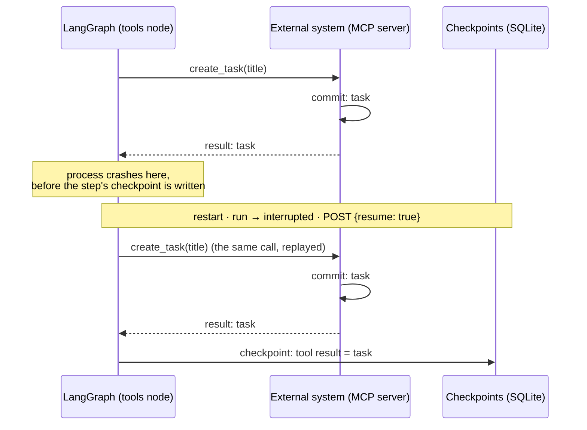

# 07 — Checkpointing does not make side effects exactly-once

> Durable orchestration gives you replay. Replay makes side-effect semantics more important, not less.

**Stage R7 · What does checkpointing not solve?** · [Learning path](../RUNTIME-LEARNING-PATH.md#stage-r7-what-does-checkpointing-not-solve) · Previous: [06](06-failure-restart-and-resume.md) · Next: [08](08-local-first-and-runtime-ownership.md)

> **Prerequisite:** you know why a model must not authorize its own mutations, and what a proposal → approval → deterministic apply flow looks like. If not: [simple-agent-template — Human-in-the-loop and controlled mutation](https://github.com/cognokratos/simple-agent-template/blob/main/docs/concepts/08-human-in-the-loop.md) and [lab 08 — Add a state-changing action](https://github.com/cognokratos/simple-agent-template/blob/main/docs/tutorials/08-add-a-state-changing-action.md). This lesson is about what happens to an _authorized_ mutation when the workflow around it is replayed.

This is an advanced, mostly design-oriented lesson. Sophos adds no write capability for it. It uses the one state-changing tool Sophos already has (the Memory MCP server) and a hypothetical one you design.

## Objective

Locate the failure window between an external side effect and the checkpoint that records it, explain why resume can repeat the side effect, and design a tool whose effect is safe under replay.

## Why it matters

[Lesson 06](06-failure-restart-and-resume.md) showed that a crashed step runs again on resume. For a model call that costs time and tokens. For a tool that sends an email, charges a card or creates a ticket, it can mean doing it twice. Durable execution frameworks make resume easy, which makes "what if this runs twice?" a question every tool must answer.

## Mental model

### The failure window



Can the mutation happen twice? **Yes.** The checkpoint is the only thing that tells LangGraph the `tools` step finished, and the external commit happened before it. Nothing in the workflow can tell "the call never reached the server" from "the server committed and the reply was lost".

The window is not only a crash. The same uncertainty appears when:

- the call **times out**: the server may still commit after the client gave up;
- the **response is lost** (connection reset after the commit);
- the process is **shut down gracefully** mid-step ([lesson 01, part 4](01-own-the-process.md#part-4-shut-down-while-a-run-is-in-flight) showed a step completing against a closed database);
- the **model retries** on its own because it read an error and decided to try again (that is a new tool call, not a replay, and no runtime mechanism can deduplicate it).

### Vocabulary

| Term                          | Meaning here                                                                                                                                                           |
| ----------------------------- | ---------------------------------------------------------------------------------------------------------------------------------------------------------------------- |
| **At-least-once**             | What Sophos gives a tool call today: a call that started may be issued again on resume.                                                                                |
| **At-most-once**              | Never retry. You get this by not resuming, and you lose the work.                                                                                                      |
| **Exactly-once**              | Not achievable across a network boundary by the caller alone. What systems actually provide is _effectively-once_: at-least-once delivery plus an idempotent receiver. |
| **Idempotent operation**      | Applying it twice has the same effect as once (`set status = done`, `delete id 17`).                                                                                   |
| **Idempotency key**           | A caller-chosen identifier for one _logical_ request. The receiver stores `key → result` atomically with the effect and returns the stored result on a repeat.         |
| **Natural-key deduplication** | The receiver refuses a duplicate because the data identifies itself (unique name, unique constraint). Safe for creation, but the second response differs.              |
| **Replay-safe**               | Running the same call again after an unknown outcome is correct.                                                                                                       |
| **Compensation**              | A later operation that semantically undoes an effect you can't prevent (cancel the duplicate order). Needed when the receiver can't be made idempotent.                |

## Where it lives in Sophos

**The replay unit is the node, not the tool call.** `toolsNode()` in `src/lib/agent/graph.ts` runs the LangGraph `ToolNode` inside one node function, so all tool calls of one assistant turn are **one graph task** with one checkpoint after it. If the model asked for two calls in one turn and the process died after the first committed, the resume re-runs both.

**The replayed calls are identical.** The assistant message containing the tool calls was checkpointed in the previous step. A resumed `tools` step reads the same message, so it issues the same calls with the same arguments **and the same `tool_call_id`s**. (A resumed `agent` step is different: it samples the model again, and may choose different tools or arguments.)

**The `tool_call_id` doesn't reach the tool server.** It is stable across replay, which makes it an excellent idempotency-key candidate, but the MCP adapter sends only the tool name and arguments. A tool that wants a key must receive it as an argument.

**Today's tools:**

| Tool                       | Side effect                               | Replay behaviour                                                                                                                                               |
| -------------------------- | ----------------------------------------- | -------------------------------------------------------------------------------------------------------------------------------------------------------------- |
| `fetch__fetch`             | outbound HTTP GET (no local state change) | Repeats the request. Safe for Sophos's state; whether a GET has effects on the _remote_ side (counters, rate limits, one-time links) is the remote's business. |
| `memory__create_entities`  | adds entities to `memory.jsonl`           | **Natural-key dedup**: entities whose `name` already exists are skipped. A replay adds nothing and returns `[]`.                                               |
| `memory__add_observations` | appends observation strings               | **Natural-key dedup**: identical strings are skipped. A replay returns empty `addedObservations`.                                                              |
| `memory__create_relations` | adds relations                            | Dedup on `(from, to, relationType)`.                                                                                                                           |
| `memory__delete_*`         | removes entities, observations, relations | Idempotent: deleting what is gone is a no-op.                                                                                                                  |

(Behaviour read from `@modelcontextprotocol/server-memory@2026.8.31`, the version pinned in `config/mcp.json`; re-check it when you upgrade.)

So Sophos's only state-changing tool is replay-safe **in effect**, by accident of its data model. Two things still differ on replay:

1. **The response.** The first call says "created `example.com`"; the replay says "created nothing". The resumed `agent` step sees only the second response, so the model may conclude the save failed and try something else.
2. **Atomicity across stores.** The write to `memory.jsonl` and the checkpoint in `sophos.db` are two commits in two systems. No transaction spans them.

## Experiment: a design lab

There is no lab command that safely reproduces the window on demand (you would need to kill the process between the MCP server's commit and the checkpoint write, which is a few milliseconds). Reason it through instead, using what you observed in [lesson 06, scenario C](06-failure-restart-and-resume.md#scenario-c-process-crash-after-a-tool-result).

### Part 1: Find the window in Sophos

Using `src/lib/agent/graph.ts`, `src/lib/agent/index.ts` and the [walkthrough](RUN-LIFECYCLE-WALKTHROUGH.md), answer:

1. Between which two events does a `memory__create_entities` call become "committed but not recorded"?
2. If the process dies there, what does the user see after restart? What does the resume send to the Memory server?
3. If the same assistant turn had called `fetch__fetch` and `memory__create_entities` together, and the crash happened after the memory write, what runs again?
4. Why would a crash during the **`agent`** step after it (the model writing its answer) _not_ repeat the memory write?

### Part 2: Design `create_task`

Design a hypothetical MCP tool, `create_task`, backed by a task tracker. Specify:

```text
request id         who generates it, and is it stable across replay?
idempotency key    what is it derived from? (thread_id? tool_call_id? a hash of arguments?)
storage behaviour  what does the server store, in which transaction as the task?
after timeout      what does the caller do: retry with the same key? report "unknown"?
after crash        what does the resumed tools step send, and what does the server answer?
if response lost   how does a later call learn the original result?
key lifetime       how long does the server keep keys? what happens after that?
key conflict       same key, different arguments: error, or first-wins?
```

Then compare the two signatures:

**Unsafe**

```text
create_task(title)
```

A replay creates a second task. The server has no way to know the two calls are one request.

**Replay-aware**

```text
create_task(idempotency_key, title)
```

The server stores `idempotency_key → task_id` in the same transaction as the task and returns the stored task on a repeat. The question you must still answer is **who supplies the key**. If the model invents it, a resumed `agent` step may invent a different one. If the runtime derives it (for example `thread_id + ":" + tool_call_id`), replay of the `tools` step is covered, because both values are fixed by the checkpoint, and a new tool call by the model is correctly treated as a new request.

### Part 3: When you can't change the server

Suppose the tracker's API has no idempotency support. What are your options? Consider: a lookup-before-create by a natural key, a client-side outbox recorded in your own durable state before the call, a human approval step that makes the mutation a separate, explicit run, and compensation. For each, name the failure it still allows.

## Why the system behaves this way

- **Checkpointing records what the workflow knows**, not what the world did. The two coincide only for effects inside the checkpoint's own transaction, and in Sophos no tool effect is.
- **Replay is the price of resumability.** A framework that never re-executes a step on resume would have to assume an unknown step succeeded, which is worse.
- **Sophos's tools are mostly reads.** That keeps the curriculum safe, and it is why this lesson is a design lab.

## What this does NOT guarantee

- Checkpointing makes **workflow state** resumable. External side effects still require their own replay/idempotency semantics.
- Sophos does **not** pass an idempotency key to tools, does not record "about to call tool X" before calling it, and does not distinguish a replayed tool call from a first one.
- Natural-key deduplication in the Memory server is a property of that server's current version, not a contract.

## Takeaway

> Durable orchestration gives you replay. Replay makes side-effect semantics more important, not less.

Before a tool changes anything, decide what "the same request" means, who names it, and where that name is stored atomically with the effect.

## Go deeper

- Challenge: [replay-safe mutating tool](CHALLENGES.md#challenge-3--replay-safe-mutating-tool), [durable HITL](CHALLENGES.md#challenge-2--durable-hitl).
- Upstream: [simple-agent-template — Controlled mutation](https://github.com/cognokratos/simple-agent-template/blob/main/docs/concepts/08-human-in-the-loop.md) (nonces, row locks and audit in one transaction: the receiving side of this lesson).
