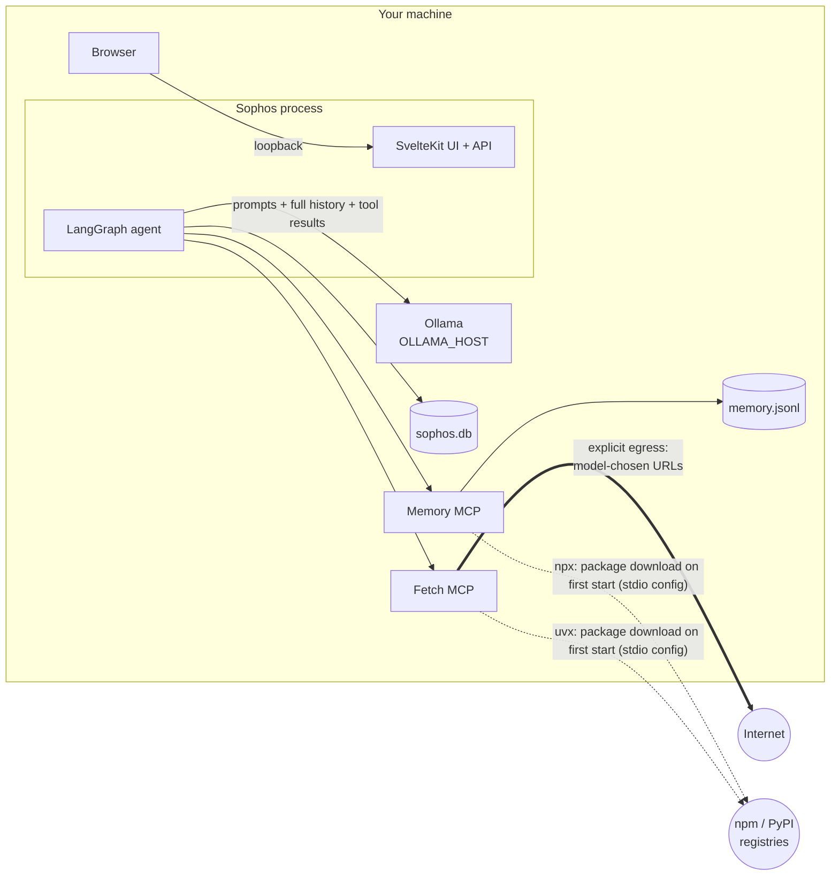

# 08 — Local-first and runtime ownership

> Local-first is an architectural property of data flows, dependencies and control boundaries.

**Stage R8 · What does local-first really mean?** · [Learning path](../RUNTIME-LEARNING-PATH.md#stage-r8-what-does-local-first-really-mean) · Previous: [07](07-side-effects-and-idempotency.md) · Then: [walkthrough](RUN-LIFECYCLE-WALKTHROUGH.md), [challenges](CHALLENGES.md)

> **Prerequisite:** trust boundaries, network segmentation, and why "it's on a private network" is not authentication: [simple-agent-template — Security and trust boundaries](https://github.com/cognokratos/simple-agent-template/blob/main/docs/concepts/07-security-and-trust-boundaries.md). This lesson is about ownership of data flows, not about identity.

## Objective

Enumerate every data flow and runtime dependency of Sophos, say which stay on the machine and which leave it, and distinguish what is **enforced** by topology from what is merely **configured**.

## Why it matters

"We run the model locally" is a statement about one component. Whether your conversations, tool results and learned facts stay under your control depends on every other arrow in the diagram: where prompts are sent, where state is written, which processes can open outbound connections, and which listeners other machines can reach.

> Local model ≠ local system.

## Mental model



| Flow                                                    | Default destination                                                         | Carries                                                      | Controlled by                                                     | Enforced?                                                                                                                                                                  |
| ------------------------------------------------------- | --------------------------------------------------------------------------- | ------------------------------------------------------------ | ----------------------------------------------------------------- | -------------------------------------------------------------------------------------------------------------------------------------------------------------------------- |
| Inference                                               | `OLLAMA_HOST` (`http://localhost:11434`; `host.docker.internal` in Compose) | system prompt, **every** message of the thread, tool results | `.env` / `infra/.env`                                             | No. Point it at a remote host and all of that goes there.                                                                                                                  |
| Orchestration                                           | in-process                                                                  | —                                                            | code                                                              | Yes (one process).                                                                                                                                                         |
| Conversation state, checkpoints                         | `DATABASE_PATH` (local file)                                                | everything above                                             | env                                                               | It's a path; a network mount would change the answer.                                                                                                                      |
| Long-term memory                                        | `MEMORY_FILE_PATH` / Memory container volume                                | learned facts                                                | env, `infra/compose.yml`                                          | As above.                                                                                                                                                                  |
| UI                                                      | loopback listener                                                           | everything                                                   | Compose `127.0.0.1:5173`; Vite's default; `HOST` for `node build` | **Compose: yes.** `node build` without `HOST` listens on all interfaces.                                                                                                   |
| Tool egress                                             | the Fetch MCP, to any URL the model chooses                                 | the URL (and anything the model encodes in it)               | `mcp.json`                                                        | **Only by configuration.** The Compose default network is not `internal`; every container can reach the internet.                                                          |
| Package resolution (stdio config: `pnpm dev`, the labs) | npm / PyPI, when `npx` / `uvx` first start a server                         | package names and versions                                   | `config/mcp.json` (pinned versions)                               | No. Docker builds resolve dependencies at build time instead.                                                                                                              |
| Tracing / telemetry                                     | none                                                                        | —                                                            | Sophos sends none                                                 | Sophos sets none. LangChain.js libraries read tracing settings from the environment (`LANGSMITH_TRACING`); nothing in Sophos prevents a stray variable from enabling them. |

## Where it lives in Sophos

- `src/lib/agent/config.ts` — `getModelConfig()`: `OLLAMA_HOST`, read once when the graph is built.
- `config/mcp.json` — stdio servers for `pnpm dev` and `node build` (`npx`, `uvx`, pinned versions).
- `infra/app/config/mcp.json` — HTTP servers on the Compose network.
- `infra/compose.yml` — published ports (`web` only, on `127.0.0.1`), volumes, and the default network.
- [9) Security Posture](../architecture/9-security-posture.md) — the reference for listeners, data at rest and the Fetch attack surface.

## Experiment

### Part 1: Remove the Fetch MCP

Use the [lab environment](../RUNTIME-LEARNING-PATH.md#lab-environment). Create a configuration without Fetch:

```sh
mkdir -p data/lab/config-nofetch
cp config/system.md data/lab/config-nofetch/
jq 'del(.fetch)' config/mcp.json > data/lab/config-nofetch/mcp.json
cat data/lab/config-nofetch/mcp.json
```

Start the lab server with `CONFIG_DIR=data/lab/config-nofetch` in front of the usual command, and run one conversation that asks for a URL:

```sh
C=$(curl -s -X POST $B/api/chat -H 'content-type: application/json' \
  -d '{"message":"Fetch https://example.com and tell me what it says."}' | jq -r .conversation)
curl -sN "$B/api/chat?conversation=$C" > /dev/null
curl -s $B/api/conversations/$C | jq -c '.messages[] | {role, calls: [.toolCalls[]?.name]}'
```

**Observed:** no tool calls to `fetch__fetch` are possible; the model only has `memory__*` tools.

### Part 2: Ask what network paths remain

**Predict first.** Write down every network connection the Sophos process and its children can still make. Then inspect:

```sh
# Listeners: who can connect to Sophos?
lsof -nP -iTCP -sTCP:LISTEN | grep -E 'node|ollama'

# Outbound: what is the Sophos process connected to right now?
lsof -nP -iTCP -sTCP:ESTABLISHED -a -p $(lsof -nP -tiTCP:5174 -sTCP:LISTEN)

# Where do prompts go?
grep OLLAMA_HOST .env

# Which MCP servers, over which transport?
cat data/lab/config-nofetch/mcp.json

# Is anything in the environment enabling library tracing?
env | grep -iE 'langsmith|langchain' || echo "none"
```

**Observed** (one machine): Sophos listened on `127.0.0.1:5174` only (because the lab sets `HOST`; restart it without `HOST` and look again). Its only established connection went to Ollama on `[::1]:11434` (a kept-alive HTTP connection). The Memory server is a child process speaking stdio: no socket at all.

Look at the Ollama line, too. On the machine used for this lab, Ollama listened on `*:11434`, **all interfaces**, because of how it had been configured outside Sophos. Anyone on that network could use the model server directly. Sophos's loopback discipline ends at its own listener; the dependencies you run beside it are yours to own as well.

Questions to answer from what you found:

1. If `OLLAMA_HOST` pointed at a GPU box on your LAN, what would leave the machine, and how much of each conversation?
2. The first time `npx` started the Memory server, what did it contact?
3. Without Fetch, can a prompt injection still exfiltrate data? (Consider what the UI renders: [9) Security Posture](../architecture/9-security-posture.md#explicit-egress-the-fetch-mcp) explains why model-produced images are shown as links and never loaded.)

### Part 3: Reason about the Compose topology

The Compose stack is the configuration that is meant to be "local" for others. Read its effective configuration without starting anything (requires `infra/.env`, see [Getting Started](../../README.md#-getting-started)):

```sh
docker compose -f infra/compose.yml --env-file infra/.env config --format json \
  | jq '{networks, ports: [.services | to_entries[] | {service: .key, ports: .value.ports}]}'
```

**Observed:** only `web` publishes a port, on `127.0.0.1`; the MCP services publish nothing (and `scripts/test.sh` asserts that). The only network is `default`, without `internal: true`.

So, from topology alone:

- **Enforced:** nothing outside your machine can reach `web`, `mcp-memory` or `mcp-fetch`.
- **Not enforced:** outbound traffic. Removing Fetch from `infra/app/config/mcp.json` removes the _tool_ that makes requests, but `web`, `mcp-memory` and `mcp-fetch` can all still open connections to the internet. "Explicit egress" in Sophos is a property of configuration and tool design, not of the network.

What would you change to make egress enforced? (An `internal` network for `web` and `mcp-memory`, a second network only `mcp-fetch` joins, an egress proxy with an allow-list… and what happens to `OLLAMA_HOST=http://host.docker.internal:11434` then?) This is design, not a change to make in Sophos today.

### Compare three configurations

For each, say what leaves your control, and what an honest one-line description of the system would be:

| Configuration                                     | Inference data | Conversation state | Tool egress | Honest description |
| ------------------------------------------------- | -------------- | ------------------ | ----------- | ------------------ |
| local model + cloud tools                         |                |                    |             |                    |
| cloud model + local persistence                   |                |                    |             |                    |
| local model + local persistence + explicit egress |                |                    |             | (Sophos's default) |

Hint for the second row: local persistence of a conversation whose every message was sent to a third party protects your _copy_, not the data.

## Why the system behaves this way

- **One process, one host model server, local files** keep the default data flows short enough to enumerate.
- **Loopback publishing** is the one control that is enforced by the network rather than by configuration ([5) Trade-off Decisions](../architecture/5-trade-off-decisions.md)).
- **Fetch is the deliberate exception** and is documented as the attack surface ([9) Security Posture](../architecture/9-security-posture.md)).

## What this does NOT guarantee

- Sophos keeps inference and state local **by default**, while configured tools may create explicit network egress. "Local" does not mean "no network".
- Nothing restricts outbound connections from the process or the containers.
- There is no authentication: anyone who can reach the listener can read every conversation and drive the tools.
- Data at rest (SQLite, `memory.jsonl`) is not encrypted.

## Takeaway

> Local-first is an architectural property of data flows, dependencies and control boundaries.

Reason from the topology, not from the label. For every arrow, ask: where does it go, what does it carry, who configured it, and what stops it from going somewhere else?

## Go deeper

- Reference: [9) Security Posture](../architecture/9-security-posture.md), [4) Deployment Topology](../architecture/4-deployment-topology-docker-compose.md).
- Example: `examples/fetch-mcp-example.md`.
- Challenge: [multiple concurrent users](CHALLENGES.md#challenge-6--multiple-concurrent-users).
